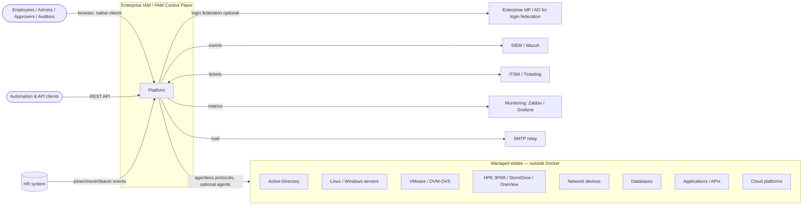
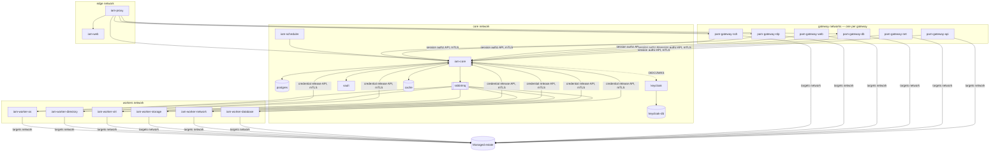

# Architecture Document — Enterprise IAM / PAM Control Plane

| Field | Value |
|---|---|
| Phase | 1 — Architecture & Domain Model |
| Version | 1.0 (Phase 1 gate candidate) |
| Date | 2026-09-21 |
| Baseline | Master Prompt §0–§85 · Phase 0 Report incl. Addendum G · ADR-0001…0014 |
| Companion documents | [Domain Model](DOMAIN-MODEL.md) · [Data Model](DATA-MODEL.md) · [Deployment](DEPLOYMENT.md) · [Worker Isolation](WORKER-ISOLATION.md) · [API Guidelines](API-GUIDELINES.md) · [Module Boundaries](MODULE-BOUNDARIES.md) · [Security Architecture](../security/SECURITY-ARCHITECTURE.md) · [Threat Model — Core](../security/THREAT-MODEL-CORE.md) |

---

## 1. Purpose and scope

This document is the authoritative architecture baseline for implementation from Phase 2 onward. It describes *what* the platform is made of, *how* the parts interact, and *what happens when each part fails*. Detailed per-concern designs live in the companion documents; this document links them rather than repeating them.

The platform is one **Enterprise IAM / PAM Control Plane** (spec §82): one governance Core, multiple first-class providers, central policy/approval/SoD/risk, central account management, central PAM, central secrets, central audit, discovery, reconciliation, modular gateways, optional agents, fail-closed security, and failure-isolated extensions.

## 2. Architectural principles (normative)

| # | Principle | Source |
|---|---|---|
| P1 | Every feature connects to the central Person → Identity → Governance → Account → Target → Session → Evidence chain. No isolated screens. | §1.1, §51 |
| P2 | Core vs Extension is explicit for every component; extensions never become hidden Core dependencies. | §2, §83 |
| P3 | Fail closed for security decisions; fail-safe isolation for availability. | §4 |
| P4 | Platform database is the source of truth for governance and authorization; Keycloak only authenticates; Vault only holds secret values. | G2, G3 |
| P5 | Account Management is Core; providers only execute target-side operations. | §8, G8 |
| P6 | Agentless by default; agents are optional capability extensions, never a second IAM. | §15–§16, G6 |
| P7 | No success without verification; unsupported capabilities are reported, never faked. | §11, §46, G5 |
| P8 | Durable intent: asynchronous work is recorded transactionally before it is dispatched. | §3, ADR-0006 |
| P9 | Every deployable is its own non-privileged container; no persistent state in container layers. | G1, ADR-0009 |
| P10 | Every privileged action is audited in the same transaction, tamper-evident, and traceable through the evidence chain. | §49–§51 |
| P11 | Server-side authorization for every request and every object; search and reports are scope-filtered. | §19, §52 |
| P12 | Additive evolution: forward-only migrations, versioned contracts, no destructive shortcuts. | §59, §78 |

## 3. System context (C4 level 1)

## 4. Containers (C4 level 2)

Every box is a separate container image (ADR-0009). Core = required for the governance plane; Extension = may be absent, disabled, or failed without affecting Core functions.

| Container | Class | Responsibility | Phase introduced |
|---|---|---|---|
| `iam-proxy` (Nginx/Traefik) | Core edge | TLS termination, routing, security headers, request size limits | 1 (dev), 9 (hardened) |
| `iam-web` | Core | React/TS/MUI SPA static assets | 1 (skeleton), 2 |
| `iam-core` | **Core** | Modular monolith: all governance modules (§5), REST API, BFF session, policy/SoD/risk evaluation, audit, outbox, operation state, session broker API, health aggregation | 1 (skeleton), 2 |
| `iam-scheduler` | Core infrastructure | Time-based triggers (rotation schedules, expiries, discovery, reconciliation, reviews). Emits commands through Core API/outbox; executes no provider work | 2 (expiry), 8 |
| `iam-worker-<group>` | Extension host | Worker pools executing provider operations per ADR-0010 | 3 |
| `pam-gateway-ssh` | Extension | SSH proxy, web terminal, recording, command audit | 6 |
| `pam-gateway-rdp` (+ `guacd`) | Extension | RDP broker, credential injection, recording, clipboard/drive policy | 6 |
| `pam-gateway-web` | Extension | Reverse proxy, credential/header injection for web apps | 6 |
| `pam-gateway-db` | Extension | Web SQL terminal, per-engine native proxies where supported | 6 |
| `pam-gateway-net` | Extension | Network CLI sessions | 6 |
| `pam-gateway-api` | Extension | Governed API access, token brokering, rate limiting | 6 |
| `iam-agent` | Extension (on managed hosts, not in Compose) | Telemetry and local enforcement | 6+ |
| `integration-<name>` | Extension | HR, SIEM, ITSM, CMDB, webhooks | 8 |
| `postgres` | Core dependency | Platform system of record | 1 |
| `keycloak` (+ own `keycloak-db`) | Core authentication dependency | Login, MFA, step-up | 1 |
| `vault` | Core secret dependency (fails closed for secrets only) | Secret values, PKI, transit | 1 |
| `rabbitmq` | Core infrastructure (buffered by outbox) | Work distribution | 1 |
| `cache` (Redis-compatible) | Optional | Cache, rate-limit counters | 1 |
| `object-store` | Extension (recordings) / archive (audit segments) | WORM storage | 6 |

## 5. `iam-core` internal structure

`iam-core` is a Spring Boot 4 modular monolith (ADR-0002, ADR-0014). Modules, their public APIs, and allowed dependencies are defined in [MODULE-BOUNDARIES.md](MODULE-BOUNDARIES.md) and enforced by Spring Modulith verification plus ArchUnit in CI.

Layering inside each module: `api` (public interfaces, DTOs, events) → `application` (use cases, transactions, authorization checks) → `domain` (aggregates, invariants, domain services — no framework dependencies) → `infrastructure` (JPA repositories, adapters). Only `api` is visible to other modules.

Cross-module interaction rules:
1. Synchronous calls only through another module's `api` package.
2. State changes that other modules react to are published as domain events (Spring Modulith event publication registry, persisted in PostgreSQL) — so a failing listener never rolls back or loses the originating change.
3. Nothing in `iam-core` imports provider implementations, gateway code, agent code, or integration code.

## 6. Cross-cutting mechanisms

### 6.1 Authentication (G2, ADR-0004)
Browser: OIDC Authorization Code + PKCE handled by the Core as a backend-for-frontend; the browser holds only an HttpOnly/Secure/SameSite=Strict session cookie. API clients: OAuth2 client credentials or token exchange; bearer JWT validated locally against cached JWKS. Only `sub`, `acr`, `amr`, `auth_time`, `sid` are consumed from tokens; roles/scopes are resolved from the platform database on every request. Step-up: an endpoint declares a minimum `acr`; if insufficient, the API returns `STEP_UP_REQUIRED` and the UI triggers re-authentication.

### 6.2 Authorization
Two layers, both server-side: (1) **RBAC + scope** — every endpoint declares `permission` (e.g. `account:disable`) and a scope resolver that locates the object's organizational unit, environment, provider and target; (2) **policy** — sensitive actions (access, reveal, session, emergency) additionally go through the policy engine (ADR-0013). Deny by default; any error denies.

### 6.3 Policy, SoD, risk
In-process, deterministic, pure functions evaluated inside the request transaction. Each decision stores: inputs hash, policy set version, matched rules, obligations, risk factors with explanations. Errors → DENY / risk HIGH / request not approvable (Phase 0 §13.2).

### 6.4 Audit (ADR-0008)
`audit` module offers `AuditRecorder.record(event)` which must be called inside the business transaction; the event row carries hash-chain fields. For privileged and emergency operations the business transaction commits only if the audit insert succeeds (G-07). SIEM export reads audit rows asynchronously.

### 6.5 Operations and outbox (ADR-0006, ADR-0010)
Any action executed outside the Core process becomes an **Operation** (state machine in [DOMAIN-MODEL.md](DOMAIN-MODEL.md) §9) plus an outbox row, both in the same transaction. The relay publishes to the provider-type queue; results return on `iam.ops.results`. `SUCCEEDED` only with a verification record.

### 6.6 Secrets (G3, ADR-0005)
The `secrets` module is the only code talking to Vault. It hands out **credential handles** (opaque, single-use, short-lived IDs); workers and gateways redeem a handle over mTLS to receive the value just-in-time; the value is never persisted outside Vault, never logged, and never returned to the browser except through an explicit, policy-controlled, audited *reveal*.

### 6.7 Observability
OpenTelemetry traces with W3C `traceparent` propagated HTTP → Core → outbox message headers → worker → provider call; `correlationId`, `operationId`, `providerId`, `sessionId` in structured JSON logs (Wazuh-compatible fields), metrics via Prometheus endpoints. Secret values are never attributes, labels, or log fields.

### 6.8 Configuration and feature toggles
Each extension capability has an enable flag in platform configuration. Disabling an extension marks its capabilities `UNAVAILABLE` and hides actions in the UI; it never changes Core behaviour.

## 7. Dependency behaviour (normative)

The degradation matrix in Phase 0 Appendix B is normative, refined by Addendum G:

| Dependency | Continues | Fails closed | Notes |
|---|---|---|---|
| Keycloak | Existing sessions until access-token expiry (≤5 min) and BFF session policy; all API processing for those sessions | New logins, token refresh, step-up | G2 |
| Vault | Identity, organization, RBAC, policy management, request creation, approvals, audit, reporting, target metadata, non-secret provider metadata, health | Reveal, rotation, credential handle redemption, session credential injection, provider ops needing secrets (`SECRETS_UNAVAILABLE`); such operations wait queued until timeout | G3 |
| RabbitMQ | All synchronous functions | — | Outbox buffers; operations show `QUEUED` |
| Cache | Everything | — | Fallback to PostgreSQL; per-instance rate limiting |
| Any worker pool / provider | Everything except that provider's operations | That provider's operations → `UNAVAILABLE` | G4, G5 |
| Any gateway | Everything except that channel | New sessions on that channel | G7 |
| Agent | Agentless capabilities | Agent-only capabilities → `UNAVAILABLE` | G6 |
| Object store | Everything except recording-required sessions | Recording-required sessions refused | ADR-0008 |
| PostgreSQL | — | Platform unavailable | HA in Phase 10 |

## 8. Component resilience assessment (spec §83 — ten questions)

Q1 Core or Extension · Q2 If unavailable · Q3 What depends on it · Q4 What must continue · Q5 Fails closed for security? · Q6 Isolated for availability? · Q7 Safely disableable? · Q8 Independently upgradable? · Q9 Independently testable? · Q10 Replaceable?

| Component | Q1 | Q2 | Q3 | Q4 | Q5 | Q6 | Q7 | Q8 | Q9 | Q10 |
|---|---|---|---|---|---|---|---|---|---|---|
| iam-core | Core | Platform API down | Everything | n/a (made HA, Phase 10) | Yes — deny on internal error | Stateless replicas | No (is the Core) | Rolling, migrations backward-compatible | Yes (Testcontainers) | Module-by-module |
| iam-web | Core (UI) | UI down | Human users | API, workers, gateways' live sessions | n/a | Yes | No | Yes | Yes (Playwright) | Yes (API-first) |
| iam-scheduler | Core infra | Timed jobs delayed | Expiry, rotation schedules, discovery | All interactive functions | **Expiry enforced also at use time** (grants checked against `not_after` on every redemption) | Yes | Yes (with backlog) | Yes | Yes | Yes |
| postgres | Core dep | Platform down | Everything in Core | — | Yes | HA later | No | Minor versions rolling; major via procedure | Yes | PostgreSQL-compatible only |
| keycloak | Core auth dep | No new logins | Authentication | Existing sessions, workers, gateways' sessions | Yes | Yes | No | Yes | Yes | Any OIDC provider (ADR-0004) |
| vault | Core secret dep | Secret ops fail | Secrets, rotation, injection | Non-secret Core (G3) | Yes | Yes | No | Yes | Yes | Equivalent secret platform via `secrets` port |
| rabbitmq | Core infra | Async delayed | Workers, integrations | All sync functions | n/a | Yes (outbox) | No | Yes | Yes | AMQP brokers / other via relay port |
| cache | Optional | Slower | Nothing functionally | Everything | Revocation authoritative in DB | Yes | Yes | Yes | Yes | Any Redis-compatible (e.g. Valkey) |
| iam-worker-<group> | Extension host | That group's ops wait/fail | That group's providers | Other groups, all Core | Yes (no success without verification) | Yes (own container/queues) | Yes | Yes | Yes (contract kit) | Yes |
| provider-<type> | Extension | `UNAVAILABLE` | Accounts on that type | All other providers | Yes | Yes (bulkhead, breaker) | Yes | Yes (plugin version) | Yes (contract kit) | Yes (SPI) |
| pam-gateway-<channel> | Extension | Channel unavailable | Sessions on that channel | Everything else incl. other gateways | Yes (grant required, recording-required refuses) | Yes | Yes | Yes | Yes | Yes (session authz API) |
| iam-agent | Extension | Agent capabilities `UNAVAILABLE` | Deep telemetry, local enforcement | Agentless capabilities | Yes (last signed policy, restrict only) | Yes | Yes | Yes (signed updates) | Yes | Yes |
| integration-<name> | Extension | Integration backlog | That integration | Everything | n/a | Yes (outbox) | Yes | Yes | Yes | Yes |
| object-store | Extension | Recording-required sessions refused | Recordings, audit archive | Everything else | Yes | Yes | Yes (recording feature off) | Yes | Yes | Any S3 + Object Lock |
| iam-proxy | Core edge | External access down | All external clients | Internal jobs | n/a | Replicable | No | Yes | Yes | Nginx ↔ Traefik |

## 9. Agent architecture (summary; full design Phase 6)

Agentless by default (G6). Agent = execution / enforcement / telemetry component. Registration: agent generates key pair → CSR → `PENDING_APPROVAL` → admin approval → certificate from Vault PKI → `ACTIVE`. Communication: agent-initiated mTLS to Core (no inbound port on the host, no internet). Receives signed, versioned policy bundles; sends telemetry batches. Offline: enforces last bundle, can only restrict. States per §17. No identity store, no approval logic, no authorization decisions of its own.

## 10. PAM gateway architecture (summary; full design Phase 6)

Each gateway is stateless apart from in-flight sessions and follows the same contract: (1) user presents a grant reference + platform session; (2) gateway calls Core `POST /internal/v1/sessions:authorize` over mTLS; (3) Core evaluates grant validity, policy obligations, step-up, concurrency, recording availability; (4) Core returns session ticket + credential handle + obligations; (5) gateway redeems the handle, connects to the target, streams events/recording; (6) Core can revoke at any time — gateways poll/stream revocations and must terminate within 5 s; if a gateway loses contact with Core for longer than the configured grace, it terminates sessions (fail closed).

## 11. Database governance vs database PAM (G9)

| | Database Governance / Account Management | Database PAM Access |
|---|---|---|
| Deployable | `iam-worker-database` with `provider-database-<engine>` plugins | `pam-gateway-db` |
| Phase | 5 | 6 |
| Functions | discovery, users, roles, privileges, lifecycle, password management/rotation, reconciliation, ownership, audit | sessions, credential injection, JIT, session control, query/activity audit where supported, recording where supported, termination |
| Shared | Target, Account, Entitlement model; per-engine capability matrix | same |
| Engines | Oracle, MSSQL, PostgreSQL, MySQL, MariaDB, Db2, SAP HANA, MongoDB — each with its own capability descriptor | same, each engine's proxy/recording support declared separately |

## 12. Quality attributes and initial targets

Targets pending Q-18 confirmation: 10k identities, 100k accounts, 5k targets, 200 concurrent privileged sessions. API p95 < 300 ms for reads, < 800 ms for policy-evaluated writes at that scale; login never calls providers; lists always paginated; provider operations async.

## 13. Traceability

Requirements map to this architecture through `docs/traceability/rtm.csv` (column `architecture_ref`).
