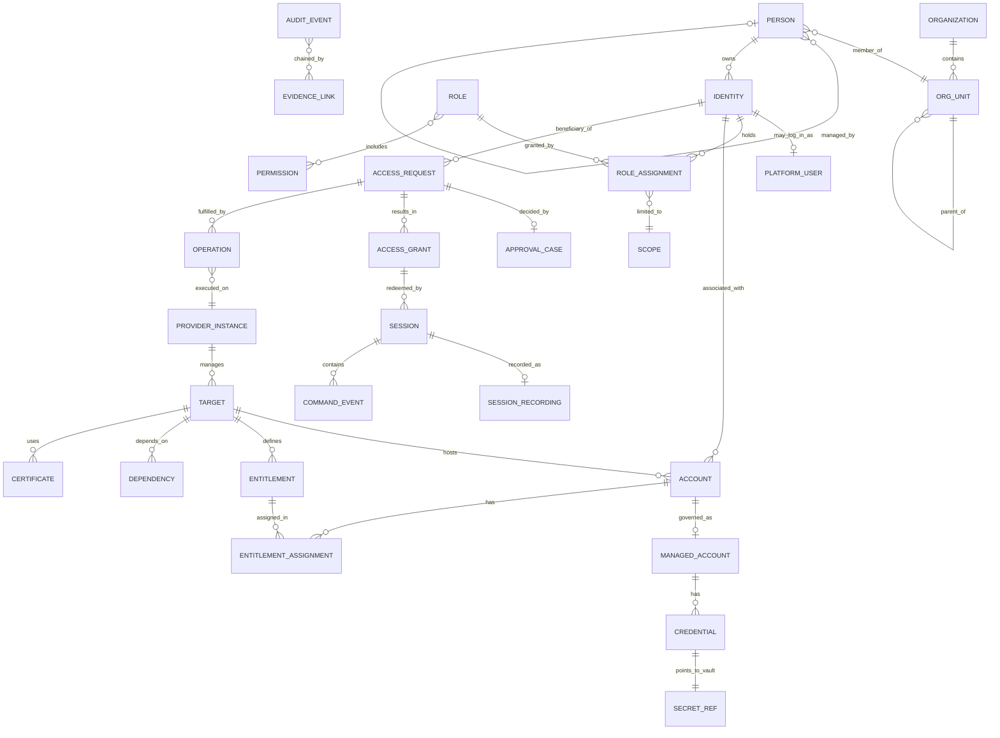
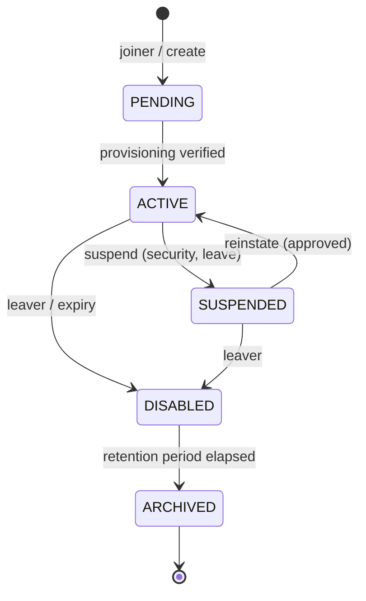
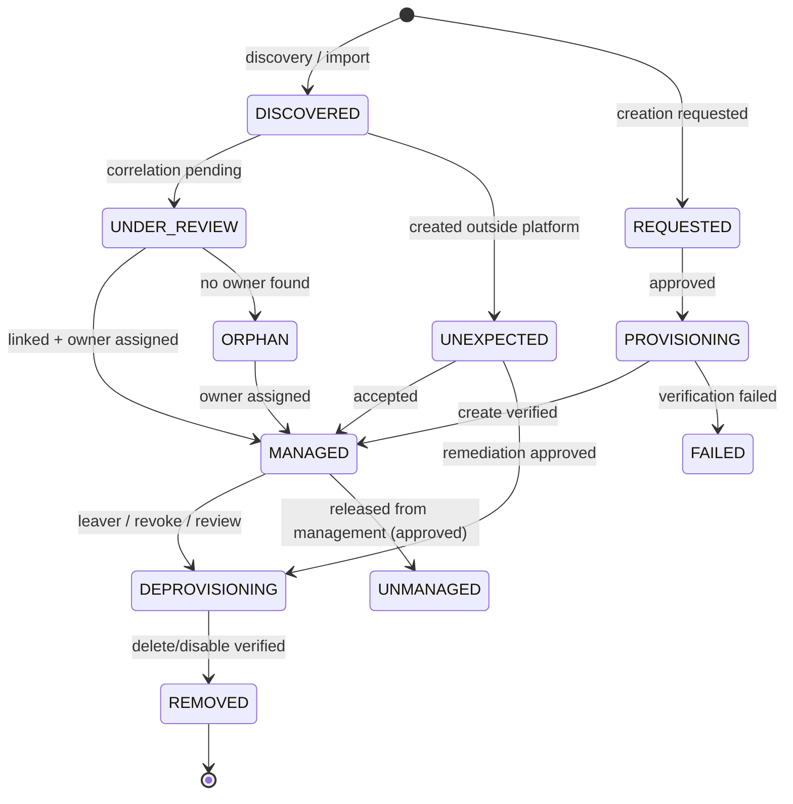
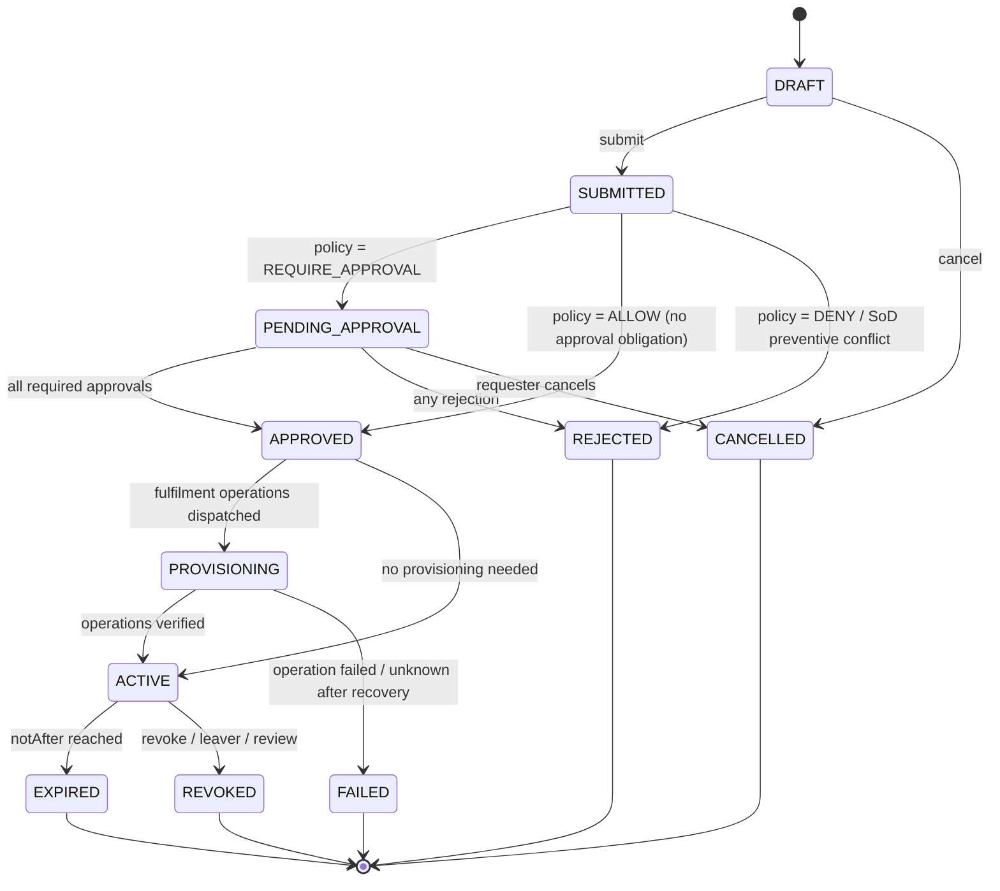
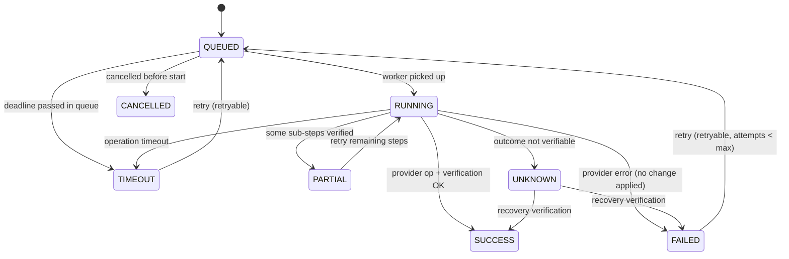

# Domain Model

| Field | Value |
|---|---|
| Phase | 1 |
| Version | 1.0 |
| Scope | All domain concepts of spec §9, with aggregates, invariants, lifecycles, and ownership. Implementation is phased; the model is not. |

Conventions: **Aggregate** = consistency boundary persisted and changed atomically. IDs are UUIDv7 (time-ordered) wrapped in typed IDs (`IdentityId`, `AccountId`, …). Every aggregate has `version` (optimistic locking), `createdAt/By`, `updatedAt/By`. Soft deletion (`archivedAt`) for governance objects; audit and evidence are never deleted except by retention policy under dual control.

---

## 1. Bounded contexts and owning Core modules

| Context | Module(s) | Aggregates | Phase |
|---|---|---|---|
| Organization | `organization` | Organization, OrgUnit (BusinessUnit / Department / Team), Position, Location | 2 |
| Identity | `identity` | Person, Identity, PlatformUser | 2 |
| Authorization | `authorization` | Role, Permission (catalog), RoleAssignment, Scope | 2 |
| Policy | `policy` | PolicySet, Policy (versioned) | 2 (model), 4 (engine) |
| Risk | `risk` | RiskModel (versioned), RiskAssessment (value object on decisions) | 4 |
| SoD | `sod` | SoDRule, SoDException | 4 |
| Targets & Assets | `target` | Target, Asset, Dependency, LicenseContract | 2 (target metadata), 5, 8 |
| Providers | `provider` | ProviderInstance, CapabilitySnapshot | 1 (SPI), 3 |
| Accounts | `account` | Account, ManagedAccount, Entitlement, EntitlementAssignment | 3 |
| Secrets | `secrets` | Credential (metadata), SecretRef, RevealRecord, DualControlRelease | 2 (broker), 3, 6 |
| Requests | `request` | AccessRequest | 4 |
| Approval | `approval` | ApprovalWorkflow (definition), ApprovalCase | 4 |
| Access grants & sessions | `session` | AccessGrant, Session, SessionRecording (metadata), CommandEvent, FileTransferEvent | 4 (grant), 6 |
| Operations | `operation` | Operation, OutboxMessage, Task, WorkflowInstance | 2 |
| Notifications | `notification` | NotificationTemplate, Notification | 2 |
| Audit & evidence | `audit` | AuditEvent, AuditCheckpoint, EvidenceLink | 2 |
| Certificates | `target` (sub-area) → own module in Phase 8 if needed | Certificate | 8 |
| Agents & gateways | `provider` (registry side) | Agent, Gateway (registration, health) | 6 |
| Integrations | `operation` (outbound) + `integration-*` containers | Integration | 8 |
| Reviews | `request` / `approval` | AccessReviewCampaign, ReviewItem | 4 |

## 2. Core relationships

## 3. Organization, Person, Identity (§5–§7)

**Person** — human or organizational owner; never authenticates. Invariants: `employeeId` unique when present; `manager` must not create a cycle; end date ≥ start date.

**Identity** — the security principal. Types: `EMPLOYEE, CONTRACTOR, CONSULTANT, SERVICE, SYSTEM, EMERGENCY, TEMPORARY, EXTERNAL`. Invariants:
- Every Identity has an owning Person (SERVICE/SYSTEM identities: the *responsible* human owner Person).
- `EMERGENCY`, `TEMPORARY`, `CONTRACTOR`, `EXTERNAL` require `validUntil`.
- Lifecycle state changes only via the identity lifecycle service, each change audited.

**PlatformUser** — 1:1 with an Identity that logs into the platform; holds `keycloakSubject` (unique), MFA enrolment status (mirrored, informational). Keycloak is not authoritative for anything else (G2).

**JML** (Phase 4): Joiner / Mover / Leaver are workflows (WorkflowInstance) composed of domain commands; the Leaver workflow executes the §7 sequence in order (identity disabled → sessions revoked → accounts disabled → privileged access revoked → tokens revoked → credentials rotated where required → access removed → evidence recorded) and each step is an auditable Operation or domain change.

## 4. Authorization (§19)

- **Permission** — catalog entry `resource:action` (e.g. `identity:read`, `account:disable`, `secret:reveal`), defined in code, synchronized to DB by migration.
- **Role** — named set of permissions. Built-in roles per §19 are seeded and not deletable (can be cloned).
- **Scope** — restricts a RoleAssignment: any combination of org units (with/without descendants), environments, provider types/instances, targets or target groups. Empty scope is **not** "global": global requires explicit `GLOBAL` scope, assignable only by Platform Administrators under dual control.
- **RoleAssignment** — (identity, role, scope, validFrom, validUntil, source: DIRECT | REQUEST | JML | EMERGENCY). SoD evaluated on create.
- Decision: `authorize(identity, permission, resourceRef) → PERMIT | DENY` + reason; resourceRef resolves to org unit, environment, provider, target.

## 5. Policy, Risk, SoD (§22–§24)

- **Policy** — see ADR-0013. Published versions immutable; PolicySet version = hash of active policies; each decision references it.
- **Decision** — `effect ∈ {ALLOW, DENY}`, `obligations ⊆ {REQUIRE_APPROVAL, REQUIRE_MFA, REQUIRE_STEP_UP_AUTH, REQUIRE_JUSTIFICATION, REQUIRE_DUAL_CONTROL, REQUIRE_RECORDING, REQUIRE_SESSION_TIMEOUT}` with parameters; the API exposes the §23 list as the flattened decision set.
- **RiskAssessment** — `score (0–100)`, `level (LOW, MEDIUM, HIGH, CRITICAL)`, `factors[] {factor, weight, value, contribution, explanation}`, `modelVersion`. Error → level HIGH.
- **SoDRule** — `leftSet`, `rightSet` (roles, entitlements, or duties such as REQUESTER/APPROVER/OPERATOR/AUDITOR), `mode (PREVENTIVE | DETECTIVE)`, `severity`. Built-in rules: requester ≠ approver; requester ≠ final approver; operator ≠ auditor; developer ≠ production approver; DB operator ≠ DB auditor.
- **SoDException** — time-bound, approved via ApprovalCase, evidenced.

## 6. Accounts & entitlements — Core (§8, G8)

**Account** — any account existing on a Target (discovered or created). Attributes: target, nativeId, name, `accountType (LOCAL, DOMAIN, DATABASE, APPLICATION, NETWORK, VIRTUALIZATION, STORAGE, CLOUD)`, `usage (HUMAN, SERVICE, SHARED, EMERGENCY, TEMPORARY)`, `privilegeClass (STANDARD, ELEVATED, PRIVILEGED, CRITICAL)`, `riskClass`, `ownerIdentity`, `linkedIdentity`, `nativeStatus (ENABLED, DISABLED, LOCKED, EXPIRED, UNKNOWN)`, `lastSeenAt`, `credentialExpiresAt`, `source (DISCOVERED, CREATED_BY_PLATFORM, IMPORTED)`.

Governance state (owned by Core, never by providers):

Findings (detective, Phase 3/8): orphan, unmanaged, dormant (no use > N days), unexpected, privileged-without-owner, outside-policy, expired-credential, excessive-privilege, created-outside-platform. Discovered accounts are never auto-deleted or auto-disabled.

**ManagedAccount** — an Account under credential governance: credential policy, rotation schedule, checkout/reveal policy, dual-control flag, emergency flag.

**Entitlement** — group, role, privilege, or permission on a Target (native id, type, privilege level). **EntitlementAssignment** — account ↔ entitlement with desired vs actual state (drives reconciliation).

## 7. Targets, assets, providers (§10–§14, §41–§43)

- **Target** — attributes per §10. `Windows Server` and `Active Directory` are different target types (§14). A Target references exactly one ProviderInstance per management channel (e.g. a Windows server may have a `windows-local` instance and be joined to an `ad` target).
- **Asset** — inventory view of a Target (category tree per §41) plus license/contract metadata (§55).
- **Dependency** — directed edge Target → Target with type (RUNS_ON, STORES_ON, CONNECTS_TO, DEPENDS_ON); queryable graph (§43).
- **ProviderInstance** — (type, version, connection config with secret references only, enabled flag, health, circuit state, capability snapshot).
- **CapabilitySnapshot** — per target: map `Capability → {status: SUPPORTED | UNSUPPORTED | UNAVAILABLE | DEGRADED | AGENT_REQUIRED, reason, since}`; computed from provider descriptor + provider health + agent presence + gateway health.

## 8. Requests, approvals, grants (§20–§21, §28–§29)

**AccessRequest** lifecycle (§20):

Invariants: justification required when policy obliges; emergency flag requires emergency workflow; requester ≠ any approver; policy, SoD, and risk results are snapshotted on the request at submission and re-evaluated at approval and at grant redemption.

**ApprovalCase** — instance of an ApprovalWorkflow: steps (sequential), each step with approver groups (parallel), quorum (any/all/N), conditions, due dates, delegation. **Approval** decision is immutable, identity-bound, records authentication context (`acr`, MFA), timestamp, comment.

**AccessGrant** — the only artifact a gateway or worker can redeem: identity, account, target, channel, `notBefore`, `notAfter`, obligations, `status (ACTIVE, EXPIRED, REVOKED)`. Checked on every redemption regardless of scheduler state.

**Emergency access** — AccessRequest with `emergency=true` following an emergency workflow (justification, MFA, dual control if configured, short maximum duration, mandatory recording, post-use rotation, post-emergency review task). Never bypasses audit.

**DualControlRelease** — secret release requiring two distinct identities' approvals (and optional split knowledge: part A to user A, part B to user B), each audited.

## 9. Operations (§46–§47)

Attributes per §46 plus `idempotencyKey`, `queue`, `providerInstanceId`, `correlationId`, `deadline`, `verification {method, verifiedAt, evidence}`. Invariant: **`SUCCESS` requires a verification record** (or a provider capability explicitly declaring `verification: NOT_POSSIBLE`, in which case the terminal status is `UNKNOWN`, never `SUCCESS`). One in-flight mutating operation per Account (per-account lock) to avoid conflicting changes.

## 10. Sessions (§37–§40)

**Session** — grant, identity, target, account, channel, source IP, gateway instance, start/end, `state (AUTHORIZED, CONNECTING, ACTIVE, IDLE, TERMINATING, ENDED, FAILED)`, policy snapshot, recording state `(NOT_REQUIRED, RECORDING, UNAVAILABLE, SEALED)`, termination reason. Concurrency limits per identity/account/target. **CommandEvent** and **FileTransferEvent** — who, what, target, account, time, request, approval, policy result, action (ALLOW, DENY, REQUIRE_APPROVAL, REQUIRE_MFA, RECORD, ALERT, TERMINATE), result.

## 11. Audit & evidence (§49–§51)

**AuditEvent** — fields per §49 plus `chainPartition`, `sequence`, `prevHash`, `hash`, `schemaVersion`. **AuditCheckpoint** — signed hash of a partition range. **EvidenceLink** — typed edges forming the chain Policy → Request → Approval → Provisioning (Operation) → Credential → Session → Recording → Audit → Revocation, queryable by request ID to produce the official Access Request document (§54).

## 12. Agents & gateways (§16–§17)

**Agent** — states `REGISTERED, PENDING_APPROVAL, ACTIVE, UPDATING, DEGRADED, OFFLINE, REVOKED, DECOMMISSIONED`; metadata per §17. **Gateway** — channel, instance id, certificate, version, health, active session count. Both are registry entries in the Core; neither holds governance state.

## 13. Ubiquitous language (selected)

| Term | Meaning |
|---|---|
| Beneficiary | Identity that will receive access (may differ from requester) |
| Fulfilment | Operations needed to make an approved request effective |
| Verification | Independent read-back from the target confirming the intended state |
| Credential handle | Opaque, single-use, short-lived reference redeemable for a secret value |
| Grant redemption | A gateway/worker presenting a grant to obtain a session or credential |
| Drift | Difference between desired and actual state found by reconciliation |
