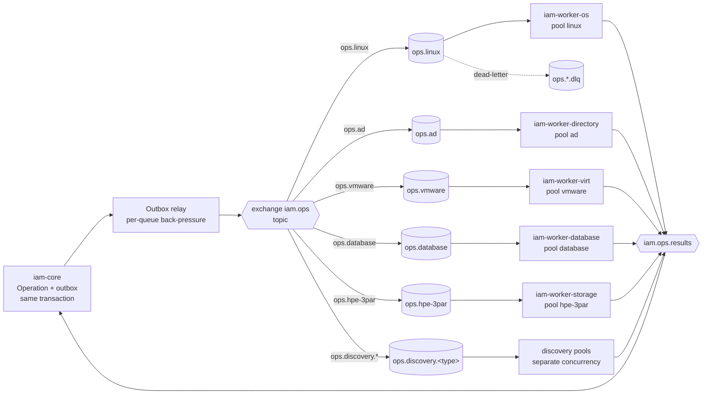

# Worker Isolation Design

| Field | Value |
|---|---|
| Phase | 1 (design); implemented Phase 2 (outbox/relay) and Phase 3 (pools, providers) |
| Decision | ADR-0010 |
| Contracts | `contracts/messaging/operation-command.schema.json`, `operation-result.schema.json` |

## 1. Goal

A slow, failing, or unavailable provider must never consume capacity required by any other provider (gate clarification G4). Examples that must hold and are tested at the Phase 3/5 gates: VMware outage → Linux operations unaffected; database provider outage → AD operations unaffected; storage outage → Windows operations unaffected.

## 2. Topology

## 3. Per-pool controls

| Control | Default | Configurable per |
|---|---|---|
| Consumer prefetch | 1–5 | pool |
| Max concurrent operations | 8 (os), 4 (virt/storage), 4 (database) | pool, provider instance |
| Connection timeout | 10 s | provider instance |
| Operation timeout | 120 s (lifecycle), 30 min (discovery) | operation type |
| Retry | 3 attempts, exponential back-off 10 s → 5 min via delay queues | operation type; only for `retryable` errors |
| Circuit breaker | open after 50 % failures over 20 calls or 5 consecutive connection failures; half-open after 60 s | provider instance |
| Bulkhead | dedicated thread pool + connection pool per provider instance | provider instance |
| Dead letter | after max attempts or non-retryable parse/contract errors | queue |

## 4. Back-pressure

The relay reads unpublished outbox rows grouped by destination queue. For each queue it checks depth (management API or cached metrics) and in-flight limits; above the high-water mark it skips that queue only. The Core surfaces `QUEUED (back-pressure)` on affected operations. Other queues continue normally. RabbitMQ `x-max-length` + `reject-publish` overflow is set as a safety net so a runaway producer cannot fill the broker.

## 5. Circuit-open behaviour

When a provider instance's breaker opens, the pool stops acking/consuming messages for that instance (messages are re-routed to its delay queue), the worker reports provider health `UNAVAILABLE` to the Core, and the Core recomputes capability snapshots (`UNAVAILABLE` with reason). No hot-loop retries; no impact on other instances of the same type.

## 6. Idempotency and ordering

- Command carries `operationId`, `idempotencyKey`, `attempt`, `deadline`.
- Worker keeps a short-term processed-key store; providers implement idempotent semantics (e.g. create-if-absent then verify).
- The Core allows one in-flight mutating operation per account; ordering across different accounts is irrelevant.
- The Core result consumer is idempotent (`processed_message`).

## 7. Security of the worker plane

Workers authenticate to RabbitMQ with per-group credentials (vhost permissions restricted to their queues) and to the Core credential API with mTLS client certificates. They receive **credential handles**, redeem them just-in-time, keep secrets only in memory for the duration of the operation, and never log them. Workers have no database credentials for the platform DB.

## 8. Failure tests required at gates

1. Stop `iam-worker-virt` → Linux account create/disable still verified within SLA.
2. Make the VMware endpoint black-hole (Toxiproxy timeout) → its breaker opens; `ops.linux` throughput unchanged within tolerance.
3. Kill RabbitMQ during approval → approval commits, operation `QUEUED`, delivered after broker restart, exactly one provider effect.
4. Poison message → DLQ, alert, operation `FAILED`, other messages continue.
5. Vault down → every operation that needs a credential waits `QUEUED` and, at its deadline, ends `TIMEOUT` with error `SECRETS_UNAVAILABLE`; nothing is silently dropped and no cached plaintext is used. Core non-secret functions keep working throughout.
