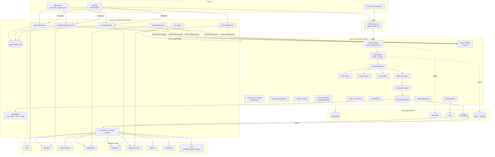
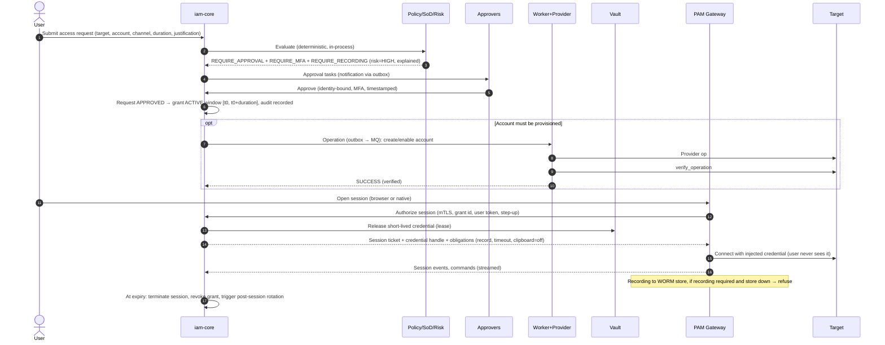
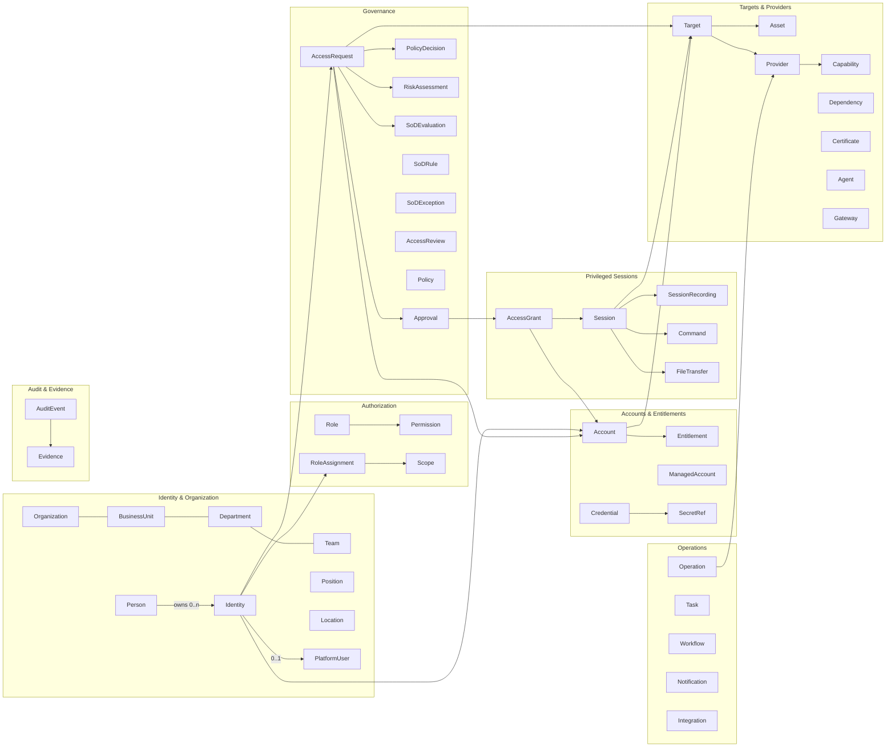
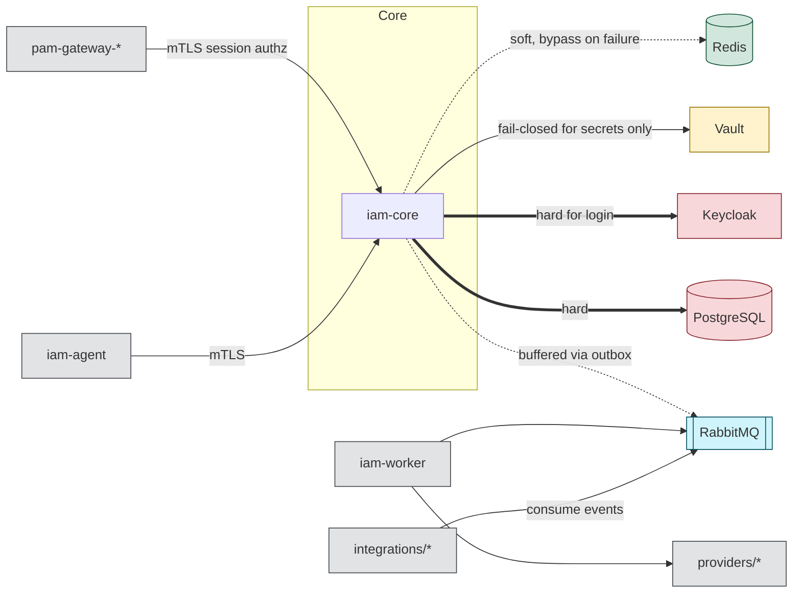
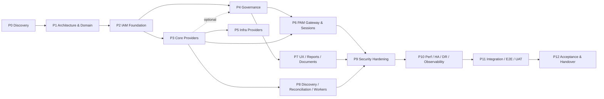

# Phase 0 Report — Discovery & Existing Environment Assessment

| Field | Value |
|---|---|
| Product | Enterprise IAM / PAM Platform — Enterprise Identity, Access, Governance & Privileged Access Control Plane |
| Phase | 0 — Discovery & Existing Environment Assessment |
| Authoritative spec | `Final Master Prompt — Enterprise IAM / PAM Platform` (§0–§85) |
| Repository assessed | `github.com/alwtiri/IAM`, branch `main`, commit `ba685c3` ("Initial commit", 2026-09-21) |
| Report date | 2026-09-21 |
| Status | **APPROVED (2026-09-21) with mandatory clarifications — see Addendum G** |

> Phase 0 gate decision: **APPROVED** with the additive clarifications recorded in **Addendum G** (end of document). Addendum G takes precedence over any statement in this report that it refines; it removes or weakens nothing in the Master Prompt or this report. Phase 1 — Architecture & Domain Model is authorized.

---

## Contents

1. Current architecture assessment
2. Existing components
3. Reusable components
4. Technical debt
5. Risks
6. Missing requirements & open questions
7. Proposed target architecture
8. Domain model
9. Dependency map
10. Phase plan
11. Phase acceptance criteria
12. Migration strategy
13. Failure-isolation strategy
14. Security strategy
15. Testing strategy

Appendices: A — Repository layout proposal · B — Degradation matrix · C — Provider capability matrix (initial) · D — ADR index · **G — Phase 0 gate clarifications (approved baseline)**

---

## 1. Current architecture assessment

The repository was inspected in full. Its complete contents at `main@ba685c3` are:

| Path | Size | Content |
|---|---|---|
| `README.md` | 118 B | Project title and one-line description |

Every item on the §77 inspection checklist was checked:

| §77 inspection item | Finding |
|---|---|
| Existing code (backend / frontend) | None |
| Architecture | None documented or implemented |
| Database / migrations | None (no schema, no Flyway scripts) |
| Docker / environment | None (no Dockerfile, Compose, `.env`, IaC) |
| APIs | None |
| Security configuration / authentication / RBAC | None |
| Existing modules | None |
| Existing tests | None |
| Existing documentation | README only |
| CI/CD | None (no `.github/workflows`, no `.gitlab-ci.yml`) |
| Branches / history | Single branch `main`, single commit |

**Conclusion:** this is a **greenfield** project. There is no existing working functionality to preserve and no existing data to migrate *inside the repository*. The "existing environment" that matters therefore lies outside the repository — the organization's infrastructure (AD, Linux/Windows estates, VMware, OVM/OVS, HPE storage, network devices, databases, HR, SIEM/Wazuh, Zabbix/Grafana, ITSM). That environment is not visible from this assessment and is captured as open questions in §6.2; those answers are inputs to Phase 1 and Phase 3/5 design.

The rule "do not destroy existing working functionality" (§77, §78) still applies from the first commit onward: every artefact created from now on is treated as existing functionality for later phases.

## 2. Existing components

| Component | Status | Notes |
|---|---|---|
| Git repository `alwtiri/IAM` | Exists | Keep; becomes the monorepo (Appendix A) |
| README.md | Exists | Keep and extend; do not replace |
| Application code, DB, infra, tests, CI | Absent | To be created from Phase 1/2 |

No existing IAM, PAM, directory, or vault instances were declared. If the organization already runs any of Keycloak, Vault, RabbitMQ, PostgreSQL, Wazuh, Guacamole, or an existing PAM/IGA product, that changes the migration strategy (§12) and must be declared before Phase 1 closes (Q-01…Q-06).

## 3. Reusable components

Nothing is reusable from the repository. Reuse comes from mature, externally maintained components that the spec already names or that cover a hard protocol problem. Building these in-house would be both slower and less secure.

| Need | Reused component | Role | Core / Extension | ADR |
|---|---|---|---|---|
| Authentication, OIDC, MFA (TOTP, WebAuthn, passkeys), step-up | **Keycloak** | Identity provider for *platform users* only; the platform's governance model stays in the platform DB | Core dependency | ADR-0004 |
| Secrets, versioning, leasing, dynamic DB credentials, transit encryption | **HashiCorp Vault** (KV v2, Transit, Database engine, PKI) | System of record for every secret value | Core dependency (fails closed) | ADR-0005 |
| Relational store | **PostgreSQL 16+** with **Flyway** | System of record for governance data and audit | Core | ADR-0001 |
| Messaging | **RabbitMQ** (quorum queues) | Async work distribution | Core infrastructure; never the only copy of a critical command | ADR-0006 |
| Cache / rate-limit counters | **Redis** | Cache only, never source of truth | Optional acceleration | ADR-0006 |
| SSH protocol | **Apache MINA SSHD** | SSH proxy inside the SSH gateway | Extension | ADR-0007 |
| RDP / VNC protocol engine, browser client | **Apache Guacamole `guacd`** (protocol daemon only; not Guacamole's auth or DB) | Rendering, recording, credential injection for RDP | Extension | ADR-0007 |
| Recording and evidence object storage | **S3-compatible object store with Object Lock** (e.g. MinIO) | WORM storage for recordings and sealed audit segments | Extension (recording) / Core (audit archive) | ADR-0008 |
| LDAP/AD | **Spring LDAP** / UnboundID SDK | AD provider | Extension (AD is optional, §13) | — |
| Remote Windows | WinRM (e.g. OverThere / PowerShell remoting via a Windows helper) | Windows Local provider | Extension | Phase 3 ADR |
| Resilience | **Resilience4j** | Timeouts, retries, circuit breakers, bulkheads per provider | Core library | ADR-0003 |
| Architecture enforcement | **Spring Modulith** + **ArchUnit** | Enforce module boundaries in the Core | Build-time | ADR-0002 |
| Observability | OpenTelemetry, Prometheus, Grafana | Metrics, traces, correlation | Core | — |

Keycloak is deliberately *not* the governance engine: roles, scopes, SoD, approvals, and policy live in the platform, so Keycloak can be replaced (§83 Q10) and so authorization decisions are never outsourced to token claims alone.

## 4. Technical debt

No code-level technical debt exists. Two debts must be tracked from day one:

1. **Environment knowledge debt.** Provider design (Phase 3, 5, 6) depends on facts about the target estate that are currently unknown (§6.2). Starting provider implementation before these are answered would create rework.
2. **Scope debt.** The spec covers the functional surface of several commercial products (IGA + PAM + secrets + CMDB-lite). Without strict phase gating, the risk is broad, shallow, "demo-grade" features — which the spec explicitly forbids (§78 "fake implementations presented as production functionality"). The mitigation is the capability model: anything not implemented returns `UNSUPPORTED_CAPABILITY` / `NOT_IMPLEMENTED`, never a fake success.

## 5. Risks

Likelihood (L) and impact (I) are rated H/M/L.

| ID | Risk | L | I | Mitigation |
|---|---|---|---|---|
| R-01 | Scope size leads to shallow implementations | H | H | Phase gating (§76); capability model with explicit `UNSUPPORTED_CAPABILITY`; RTM tracks real vs planned |
| R-02 | Core accidentally depends on an extension (hidden dependency, §83) | M | H | Separate deployables for gateways/agents/workers; ArchUnit rules forbid Core → extension imports; failure tests in every phase gate |
| R-03 | Audit written outside the business transaction and lost | M | H | Audit rows written in the **same PostgreSQL transaction** as the action; async export only for SIEM copies (§13.3) |
| R-04 | Commands lost when RabbitMQ is down | M | H | Transactional outbox in PostgreSQL; relay publishes when broker returns (§13.3) |
| R-05 | Secret leakage via logs, errors, DB columns, frontend | M | H | Vault as only secret store; `Secret`-typed wrapper with redacting `toString`; log-scrubbing filter; Gitleaks/Semgrep rules; tests asserting no secret in logs |
| R-06 | Reporting success when a provider did not actually apply the change | M | H | Operation model requires a `verify_operation` step; status `SUCCESS` only after verification, otherwise `UNKNOWN`/`PARTIAL` (§46) |
| R-07 | Password rotation desynchronises Vault and target | M | H | Two-phase rotation: stage new version in Vault as *pending*, change target, verify login, then promote; recovery job for `UNKNOWN` (§27) |
| R-08 | Database PAM over-promised across engines | H | M | Per-engine capability matrix; native protocol proxy only for PostgreSQL/MySQL/MariaDB initially; Web SQL terminal for others; Oracle/MSSQL/Db2/HANA/MongoDB interception is an explicit later decision (Appendix C) |
| R-09 | Keycloak outage blocks all logins | M | H | Keycloak HA (Phase 10); documented degraded mode; sealed local break-glass admin (disabled by default, hardware-MFA, dual-control, full audit) — **requires owner decision (Q-15)** |
| R-10 | Vault seal/outage | M | H | Fail closed for secret operations; IAM Core (identities, requests, approvals, reporting) continues; auto-unseal + HA in Phase 10 |
| R-11 | Gateway compromise yields broad lateral movement | L | H | Gateways hold no standing credentials; short-lived per-session credential release from Core; mTLS; network segmentation; gateway identity per instance |
| R-12 | Agent becomes a "second IAM" | L | M | Agent receives signed, versioned policy bundles only; no local identity/approval logic; offline mode enforces last policy, never grants new access |
| R-13 | Unknown target estate (versions, protocols, network paths) | H | M | Phase 0 open questions; Phase 3/5 start with a connectivity spike per provider |
| R-14 | Single-developer / small team bus factor | M | M | ADRs, RTM, docs-as-code, CI gates |
| R-15 | Regulatory/compliance requirements not yet specified (e.g. NCA ECC, SAMA CSF, ISO 27001, PCI) | M | M | Q-20; evidence model designed to be framework-neutral with control mappings added later |

## 6. Missing requirements & open questions

### 6.1 Gaps / ambiguities in the spec

These are points where the spec is silent or ambiguous. A proposed default is given for each; the default applies unless the owner overrides it at the gate.

| ID | Gap | Proposed default |
|---|---|---|
| G-01 | Access reviews / certification campaigns are named (§61, Phase 4 "Reviews") but not specified | Phase 4: periodic campaigns by manager / resource owner / role owner; decisions certify, revoke, or delegate; revoke feeds the normal deprovisioning path |
| G-02 | Multi-tenancy is not mentioned | Single organization per deployment; `organization_id` on core tables so multi-org is possible later |
| G-03 | Data residency and retention periods are not specified | Audit 7 years, recordings 1 year, configurable per classification; confirm (Q-19) |
| G-04 | UI language / RTL | Frontend i18n-ready from Phase 2 (English + Arabic, RTL-capable MUI theme); confirm (Q-21) |
| G-05 | Time zone for policies ("time" context) | Store UTC; policies evaluate in a configured organization time zone (default Asia/Riyadh) |
| G-06 | "Platform User" vs "Identity" relation | A Platform User is an Identity that has a login to this platform; not every Identity is a Platform User (e.g. service identities) |
| G-07 | Audit-guarantee policy for privileged ops when audit store is degraded (§4) | Privileged and emergency operations **deny** if the audit write fails; read-only low-risk operations allowed |
| G-08 | Behaviour when Keycloak is down | New logins fail closed; existing access tokens honoured until expiry (≤5 min); refresh fails; optional break-glass (Q-15) |
| G-09 | SIEM output format priority | Wazuh-compatible JSON first, Syslog (RFC 5424) second, CEF third |
| G-10 | Concurrency / scale targets | Initial sizing: 10k identities, 100k accounts, 5k targets, 200 concurrent sessions; confirm (Q-18) |
| G-11 | Delegation of approvals (out-of-office) | Supported in Phase 4 with time-bound delegation; SoD evaluated against the delegate |
| G-12 | Official Access Request document format | PDF, generated server-side, with request hash and a verification link/QR code |

### 6.2 Environment questions (inputs required before Phase 1 closes)

| ID | Question | Needed by |
|---|---|---|
| Q-01 | Is there an existing Keycloak / IdP (ADFS, Entra ID, Okta) that must be federated or reused? | Phase 1 |
| Q-02 | Is there an existing Vault or secrets platform (CyberArk, Thycotic, Azure Key Vault)? | Phase 1 |
| Q-03 | Is there an existing PAM/IGA product to migrate away from, and its data export format? | Phase 1 |
| Q-04 | Deployment target: Docker Compose on VMs only, or Kubernetes later? On-prem only / air-gapped? | Phase 1 |
| Q-05 | Is there internet egress for build/runtime, or a private registry / artifact mirror? | Phase 1 |
| Q-06 | CI platform: GitLab CI or GitHub Actions? | Phase 1 |
| Q-07 | AD: number of domains/forests, functional level, LDAPS availability, service-account model | Phase 3 |
| Q-08 | Linux estate: distributions/versions, sudo model, SSH key vs password, jump hosts | Phase 3 |
| Q-09 | Windows estate: versions, WinRM enabled?, LAPS in use?, domain vs workgroup | Phase 3 |
| Q-10 | VMware: vCenter version, SSO domain; OVM/OVS versions and management interface | Phase 5 |
| Q-11 | HPE 3PAR / StoreOnce / OneView: models, firmware, API availability, local vs LDAP users | Phase 5 |
| Q-12 | Network devices: vendors/OS (Cisco IOS/NX-OS, FortiOS, Palo Alto, F5…), TACACS+/RADIUS in use? | Phase 5 |
| Q-13 | Databases: engines and versions in scope for governance vs session PAM | Phase 6 |
| Q-14 | HR system (name, API/export) as authoritative source for joiner/mover/leaver | Phase 4/8 |
| Q-15 | Is a local break-glass platform administrator (outside Keycloak) acceptable? | Phase 2 |
| Q-16 | SIEM (Wazuh?) endpoint and ingestion method; Zabbix/Grafana versions; ITSM product | Phase 8 |
| Q-17 | SMTP relay details | Phase 2 |
| Q-18 | Scale targets (identities, accounts, targets, concurrent sessions, recording volume) | Phase 1 |
| Q-19 | Retention periods for audit, recordings, reports | Phase 1 |
| Q-20 | Compliance frameworks that evidence must map to | Phase 1 |
| Q-21 | UI languages (Arabic/English) and RTL requirement | Phase 2 |

## 7. Proposed target architecture

### 7.1 Architectural style

**A modular-monolith Core plus independently deployable extensions**, connected by asynchronous, durable messaging and narrow synchronous APIs guarded by circuit breakers (ADR-0002).

The reasoning: the Core concepts (identity, RBAC, requests, approvals, SoD, policy, risk, audit) are tightly consistent and transactional. Splitting them into microservices would introduce distributed transactions into the security-decision path, which conflicts with "critical synchronous authorization decisions must remain deterministic" (§48). Extensions (gateways, agents, workers, provider connectors) have different scaling, security-zone, and failure profiles, so they are separate processes — a crash in any of them cannot crash the Core process.

### 7.2 Runtime components

| Deployable | Type | Contents | If unavailable |
|---|---|---|---|
| `iam-core` (Spring Boot, stateless, N instances) | **Core** | Identity, Org, Person, RBAC/Scope, Access Requests, Approval, SoD, Policy, Risk, Accounts registry, Targets/Assets registry, Provider registry, Secrets broker (Vault client), Audit, Notifications (outbox), Operations model, Search, Reporting API, Health aggregator | Platform unavailable (made HA in Phase 10) |
| `iam-web` (React + TS + MUI, static) | Core | Admin and self-service UI | UI down; API still usable |
| `iam-worker` (N instances, per queue) | Core infrastructure | Executes provider operations, discovery, reconciliation, rotation, reports, notification delivery | Queued work waits; Core keeps accepting and recording requests |
| `provider-*` modules | **Extension** | Provider plugins (Linux, Windows Local, AD, Application, VMware, OVM/OVS, 3PAR, StoreOnce, OneView, Network, Database, Cloud), loaded by workers via SPI | Only that provider's operations fail; circuit opens; others unaffected |
| `pam-gateway-ssh` | Extension | SSH proxy (MINA SSHD) + web terminal websocket; asciicast recording; command audit | SSH sessions unavailable; everything else works |
| `pam-gateway-rdp` | Extension | Session broker + `guacd` sidecar; RDP recording; clipboard/drive policy | RDP unavailable only |
| `pam-gateway-web` | Extension | Reverse proxy with credential injection / header auth | Web app access unavailable only |
| `pam-gateway-db` | Extension | Web SQL terminal; native protocol proxies where supported | DB sessions unavailable only |
| `pam-gateway-net` | Extension | Network CLI via SSH/Telnet-over-SSH | Network CLI unavailable only |
| `iam-agent` | Extension (optional) | Telemetry, local enforcement, offline mode | Agent-only capabilities show `UNAVAILABLE`; agentless capabilities continue |
| `integration-*` | Extension | HR, SIEM export, ITSM, CMDB, webhooks | Integration backlog accumulates in outbox; Core unaffected |
| PostgreSQL | Core dependency | System of record + audit + outbox | Platform unavailable (HA in Phase 10) |
| Keycloak | Core dependency | Authentication/MFA | New logins fail closed (G-08) |
| Vault | Core dependency, fails closed | Secrets | Secret operations fail safely; rest of Core works |
| RabbitMQ | Core infrastructure | Work distribution | Outbox buffers; nothing lost |
| Redis | Optional | Cache, rate-limit counters | Cache bypass; per-instance rate limiting |
| Object storage (WORM) | Extension / archive | Recordings, sealed audit segments | Recording-required sessions are refused (fail closed); other sessions OK |

### 7.3 Logical architecture



### 7.4 Core internal modules (enforced boundaries)

Each module exposes a public API package; internal packages are not accessible to other modules (enforced by Spring Modulith verification and ArchUnit in CI).

| Module | Responsibility | May depend on |
|---|---|---|
| `shared-kernel` | IDs, time, errors, `Secret` wrapper, correlation context | — |
| `audit` | Append-only audit, hash chain, evidence links | shared-kernel |
| `organization` | Org, BU, Department, Team, Position, Location | shared-kernel, audit |
| `identity` | Person, Identity, Platform User, JML | organization, audit |
| `authorization` | Role, Permission, Scope, RBAC decisions | identity, audit |
| `policy` | Policy definitions, versioning, evaluation, obligations | shared-kernel (pure; receives context) |
| `risk` | Risk factors, explainable scoring | shared-kernel (pure) |
| `sod` | Rules, conflict matrix, exceptions | authorization, audit |
| `target` | Target, Asset, capability exposure, dependencies (CMDB-lite) | organization, audit |
| `provider` | Provider registry, SPI contracts, capability descriptors, health | target |
| `account` | Account, Managed Account, Entitlement, ownership, classification | identity, target, provider (API only) |
| `secrets` | Credential/Secret metadata, Vault broker, reveal, dual control | account, audit |
| `request` | Access Request lifecycle | identity, account, target, policy, risk, sod, audit |
| `approval` | Approval workflows | request, sod, audit |
| `operation` | Operation model, idempotency keys, outbox | audit |
| `session` | Session grants, JIT, session registry, recording metadata | request, secrets, policy, audit |
| `notification` | Templates, outbox-driven delivery | operation |
| `reporting` / `search` | Read models respecting RBAC scope | all (read-only via query APIs) |
| `health` | Component health aggregation and impact mapping | provider, operation |

Rule: **no Core module imports a gateway, agent, integration, or concrete provider implementation.** Concrete providers live in `providers/*` and are loaded only by workers through `java.util.ServiceLoader`/Spring plugin discovery.

### 7.5 Key flows

**Access request to privileged session (JIT):**



**Password rotation (verified, two-phase):**
`Request → AuthZ → Policy → Vault: write new version as PENDING → Provider: change password → Provider: verify login with new password → Vault: promote PENDING to CURRENT → Audit`. On failure after the target changed but before promotion, status is `UNKNOWN` and a recovery job tests both versions before deciding; Vault is never updated blindly (§27).

## 8. Domain model

### 8.1 Bounded contexts



### 8.2 Core entities (Phase 1 will turn this into the full logical data model)

| Concept | Key attributes | Key invariants |
|---|---|---|
| **Person** | employee_id, name, department, position, manager (Person), location, employment_status, start/end dates, contact | Human or organizational owner; never authenticates |
| **Identity** | type (EMPLOYEE, CONTRACTOR, CONSULTANT, SERVICE, SYSTEM, EMERGENCY, TEMPORARY, EXTERNAL), lifecycle_state, risk_level, owner Person | Service/system identities must have a human owner; EMERGENCY/TEMPORARY require expiry |
| **Platform User** | identity, keycloak_subject, mfa_enrolled, last_login | 1:1 with an Identity that logs into the platform |
| **Role / Permission / Scope** | role code, permissions (resource:action), scope (org unit, environment, provider, target, target-group) | Assignments are time-bound optionally; every assignment audited |
| **Policy** | id, version, status, conditions, effect, obligations | Immutable once published; new version for change; evaluation records policy version |
| **SoD Rule** | left set, right set, mode (PREVENTIVE/DETECTIVE), severity | Exceptions are time-bound, approved, evidenced |
| **Access Request** | requester, beneficiary identity, target, account, entitlement, channel, duration, justification, emergency flag, state (§20 lifecycle) | Requester ≠ approver; state machine transitions only via domain service |
| **Approval** | request, step, approver identity, decision, auth context (MFA/acr), timestamp | Immutable after decision |
| **Access Grant** | request, identity, account, target, channel, not_before, not_after, obligations | The only thing a gateway can redeem; expires automatically |
| **Account** | target, native id, name, type (LOCAL, AD, DB, APP, NET, VIRT, STORAGE, SERVICE), status, privilege_class, owner identity, management_state (MANAGED, UNMANAGED, ORPHAN, UNEXPECTED), last_seen | Discovered accounts are never auto-deleted |
| **Managed Account** | account, credential policy, rotation schedule, checkout policy | Credentials only in Vault |
| **Entitlement** | target/provider, native id (group, DB role, privilege), privilege level | — |
| **Target / Asset** | name, hostname, IP, DNS, type, platform, OS, environment, criticality, classification, owners, provider, location, tags, discovery/reconciliation state, health | Windows Server Target ≠ AD Target (§14) |
| **Provider** | type, version, connection config (secret refs only), capabilities, health, circuit state | Unsupported capability → `UNSUPPORTED_CAPABILITY` |
| **Credential / Secret** | type, vault_path, version, owner, expiry, rotation state, reveal history | No secret value in PostgreSQL |
| **Session** | grant, identity, target, account, channel, source IP, start/end, state, policy snapshot, recording state | Terminated at grant expiry |
| **Operation** | type, provider, target, requester, status (§46), progress, retries, idempotency key, verification result | `SUCCESS` only after verification |
| **Audit Event** | id, ts, actor, identity, action, object, target, source, result, reason, request/correlation/session IDs, IP, provider, prev_hash, hash | Append-only; UPDATE/DELETE blocked at DB level |
| **Evidence** | links policy → request → approval → provisioning → credential → session → recording → audit → revocation | Complete chain per §51 |
| **Agent** | host, version, OS, last seen, status (§17 states), certificate, capabilities, policy bundle version | Never evaluates identity/approval |

## 9. Dependency map

### 9.1 Runtime dependency direction



**Direction rule:** extensions depend on the Core; the Core never *requires* an extension to answer a request. Where the Core must reach an extension (e.g. "terminate session now"), it publishes a command to the outbox and records the intent; if the gateway is down, the grant is revoked in the Core, so any reconnection attempt is refused.

### 9.2 Phase dependency



Earlier phases never import later ones. Phase 4 governance works with zero providers enabled (requests can be approved and fulfilled manually, with fulfilment evidence captured), which satisfies §3.

## 10. Phase plan

| Phase | Scope (deliverables) | Core/Ext | Key exit evidence |
|---|---|---|---|
| **0** Discovery | This report, ADR-0001…0008, RTM skeleton, open questions | — | Gate approval of this report |
| **1** Architecture & Domain | Architecture document, full domain & logical data model, API style guide + error model, security architecture, module boundary rules, repo scaffolding (monorepo, build, CI skeleton with Gitleaks/Semgrep/Trivy), Docker Compose dev stack (PG, Keycloak, Vault dev, RabbitMQ, Redis), provider SPI contract v1, policy language v1 | Core | Architecture approved; CI green on empty skeleton; ArchUnit rules active |
| **2** IAM Foundation | Organization model, Person, Identity, Platform User, Keycloak OIDC + MFA (TOTP/WebAuthn/passkeys) + step-up, RBAC with scopes, backend authorization, audit subsystem with hash chain, operation model + outbox, notifications (SMTP), health aggregator, admin UI shell with baseline navigation, i18n | Core | Authz tests (IDOR, privilege escalation), audit integrity tests, Redis/RabbitMQ-down failure tests |
| **3** Core Providers | Provider SPI implementations: Linux (SSH), Windows Local (WinRM), Active Directory (LDAP/LDAPS), Application (REST/SCIM generic); account discovery, lifecycle, password ops, group ops, verification; circuit breakers per provider; Vault integration for provider credentials | Ext | Contract tests per provider; Testcontainers (OpenLDAP/Samba AD DC, sshd); "provider X down, others work" tests |
| **4** Governance | Access Request engine, Approval engine (single/multi/sequential/parallel/conditional/emergency), SoD (preventive/detective, exceptions), Policy engine, Risk engine (explainable), Access reviews, JML flows, emergency/break-glass (governance side), dual control, official request record | Core | SoD test suite, policy decision tests, JML end-to-end with ≥1 provider and with zero providers |
| **5** Infra Providers | VMware, OVM/OVS, HPE 3PAR, StoreOnce, OneView, Network (per vendor), Database governance (accounts/roles/privileges), Cloud (first target TBD) | Ext | Real-capability matrix per provider; `UNSUPPORTED_CAPABILITY` tests; lab verification evidence |
| **6** PAM Gateway & Sessions | SSH, RDP, Web, DB, Network CLI, API gateways; credential injection; JIT; session registry; recording; command audit & governance; file-transfer policy; timeouts; termination; concurrency limits; emergency & high-risk sessions; search/replay; secrets checkout, rotation (post-session) | Ext | Gateway-down tests; recording tamper tests; "user never receives credential" tests |
| **7** UX / Reports / Documents | Full navigation, dashboards, reports (§53), official Access Request PDF, license/contract metadata | Core | Playwright E2E; accessibility & RTL checks |
| **8** Discovery / Reconciliation / Workers / Notifications | Scheduled discovery, desired-vs-actual reconciliation, drift, orphan/dormant detection, HR/SIEM/ITSM integrations, webhook notifications, certificate discovery/expiry | Core + Ext | Drift detection tests; integration-down tests |
| **9** Security Hardening & Testing | Threat model review, ZAP DAST, API security tests, pen-test remediation, hardening baselines | — | Security Test Report |
| **10** Perf / HA / Backup / DR / Observability | Load tests, HA topology, backups with restore tests, DR runbooks, RPO/RTO measured, OTel tracing end-to-end | — | Restore test evidence; load test report |
| **11** Integration / E2E / UAT | Full scenario suites, UAT with business users | — | UAT sign-off |
| **12** Acceptance & Handover | Final documentation set (§74), operations handover, final acceptance against §81 | — | Final Acceptance Document |

Every phase follows the §76 gate: Requirements → Design → Implementation → Unit → Integration → Security → Failure tests → Documentation → Acceptance criteria → Gate approval.

## 11. Phase acceptance criteria

Criteria are testable. "Failure" criteria are mandatory in every phase from Phase 2 on.

**Phase 0**
- [ ] Repository fully inspected and findings recorded (§1–§2).
- [ ] Target architecture, domain model, dependency map, and phase plan documented.
- [ ] Every component classified Core or Extension with an "if unavailable" answer (§7.2, Appendix B).
- [ ] Initial ADRs recorded; RTM skeleton covers spec §1–§84.
- [ ] Open questions logged with the phase that needs them.

**Phase 1**
- [ ] Architecture document and logical data model approved.
- [ ] Monorepo builds; CI runs build, unit tests, ArchUnit/Modulith verification, Gitleaks, Semgrep, Trivy on every push.
- [ ] `docker compose up` starts the dev stack with no hardcoded secrets (generated or `.env` excluded from git).
- [ ] Provider SPI v1, capability enum, and error model published as versioned contracts.
- [ ] Each §83 question answered for every planned deployable.

**Phase 2**
- [ ] Person and Identity are separate aggregates; all eight identity types supported.
- [ ] Login via Keycloak OIDC with TOTP and WebAuthn; step-up enforced for sensitive endpoints.
- [ ] Every API endpoint has a server-side authorization check; automated test enumerates endpoints and fails if any lacks one.
- [ ] IDOR tests: an identity scoped to Department A cannot read or modify Department B objects via API or search.
- [ ] Audit events are written in the same transaction as the action; UPDATE/DELETE on audit table rejected by the database; hash-chain verifier detects a modified row.
- [ ] Failure tests: Redis down → login and API still work; RabbitMQ down → notifications queued in outbox and delivered after recovery with no loss; Vault down → Core non-secret functions work and secret endpoints return `SECRETS_UNAVAILABLE`.
- [ ] No secret, token, or password appears in logs (log-scan test).

**Phase 3**
- [ ] Each provider declares capabilities; unsupported calls return `UNSUPPORTED_CAPABILITY` with explanation.
- [ ] Account discovery imports accounts without modifying targets.
- [ ] Create/enable/disable/unlock/reset/rotate are idempotent and verified; `SUCCESS` only after verification.
- [ ] Linux, Windows Local, and Application providers work with AD disabled.
- [ ] Provider X unreachable → its circuit opens within configured threshold; operations on other providers unaffected (measured latency unchanged within tolerance).

**Phase 4**
- [ ] Request lifecycle matches §20; invalid transitions rejected.
- [ ] Requester ≠ approver and the other §22 rules enforced preventively; detective SoD report lists existing conflicts.
- [ ] Policy engine returns the §23 decision set; decisions record policy version and inputs; evaluation failure → DENY.
- [ ] Risk score includes a human-readable explanation of each contributing factor.
- [ ] Joiner/Mover/Leaver flows run end-to-end; Leaver completes the §7 sequence and records evidence.
- [ ] Emergency access requires justification, MFA, dual control where configured, auto-expires, and generates a post-emergency review task.

**Phase 5**
- [ ] Each infrastructure provider passes the provider contract test suite against a lab or recorded fixtures, with real capabilities only.
- [ ] Database governance manages users/roles/privileges for the engines confirmed in Q-13.

**Phase 6**
- [ ] SSH and RDP sessions through the gateway without the user seeing the credential; web and DB access per capability matrix.
- [ ] Session ends at grant expiry; admin termination takes effect within 5 s.
- [ ] Recordings stored in WORM storage; tampering detected; replay works.
- [ ] Recording-required policy + recording store down → session refused.
- [ ] Gateway process killed → Core, governance, and provider operations unaffected.

**Phases 7–12** — criteria follow §53–§54 (reports, official document), §44–§45 (discovery/drift), §68 (security testing), §63–§67 (performance, HA, DR with measured RPO/RTO and restore test), §69 (E2E/UAT), and §81 (final acceptance). They will be expanded into checklists in each phase's design document.

## 12. Migration strategy

Because the repository is empty, there is **no code or schema migration**. Migration concerns are:

1. **Repository evolution.** Keep `README.md`; add the monorepo structure (Appendix A) additively. All changes via pull requests with CI gates once Phase 1 CI exists.
2. **Schema evolution.** Flyway from the first table (`V1__baseline.sql`). Forward-only migrations; never edit an applied migration; expand-and-contract for breaking changes; no DROP/TRUNCATE of data (§59, §78). Repeatable migrations only for views/functions.
3. **Existing organizational data (onboarding, not migration).** Identities and accounts already in AD/Linux/Windows/etc. are brought in by **discovery + import + linking**, never by bulk overwrite:
   - Discover → stage as `UNMANAGED` → correlate to Person/Identity (rules: employee ID, UPN, email, naming convention) → human review for low-confidence matches → mark `MANAGED` → only then enable lifecycle actions.
   - Nothing discovered is deleted or disabled automatically during onboarding; orphan/unexpected accounts produce findings and review tasks.
4. **From an existing PAM/vault (if Q-02/Q-03 say one exists).** Import credential *metadata* first; move secret values directly into Vault via a one-time, audited, dual-controlled import job; rotate every imported privileged credential after cut-over; run both systems in parallel read-only for a defined period.
5. **Environment promotion.** Development → Testing → Staging → Production, each with its own Vault namespace/mount and Keycloak realm; no production secrets outside production (§70).

## 13. Failure-isolation strategy

### 13.1 Principles

1. **Process isolation** — every extension is a separate process/container; a crash, memory leak, or thread starvation there cannot affect `iam-core`.
2. **Bulkheads** — per-provider thread pools and connection pools in workers; one slow provider cannot exhaust shared resources.
3. **Timeouts everywhere** — connection and operation timeouts on every external call; no unbounded waits.
4. **Circuit breakers** — per provider instance (not per provider type), with health state and failure reason exposed in System Health.
5. **Durable intent** — commands to asynchronous components are written to the PostgreSQL outbox in the same transaction as the business change, so a broker outage delays but never loses work (§3 RabbitMQ).
6. **Grant-based sessions** — gateways redeem short-lived grants issued by the Core; revocation in the Core is effective even if the gateway is unreachable.
7. **No synchronous provider calls on login or page load** (§63); provider state shown from the last known snapshot with its timestamp.
8. **Feature-level degradation** — capability status per target is computed from provider/agent/gateway health: `SUPPORTED`, `UNSUPPORTED`, `UNAVAILABLE`, `DEGRADED`, `AGENT_REQUIRED` (§18).

### 13.2 Fail-closed decision table (security)

| Condition | Decision |
|---|---|
| Authorization check errors or times out | DENY |
| Approval state unverifiable | Do not grant / do not open session |
| Policy evaluation error | DENY (never default-allow) |
| SoD evaluation error | Request cannot be approved |
| Risk engine error | Treat risk as HIGH (forces approval + MFA) |
| Vault unavailable | Secret operations fail with `SECRETS_UNAVAILABLE`; no cached plaintext fallback |
| Audit write fails for privileged/emergency operation | Operation denied (G-07) |
| Recording required but recording store unavailable | Session refused |
| Keycloak unavailable | No new logins; existing short-lived tokens until expiry |
| Agent offline | Agent keeps enforcing last signed policy; can only restrict, never grant |

### 13.3 Availability behaviour per dependency — see Appendix B.

### 13.4 Verification

Each phase gate includes automated failure tests (Toxiproxy / Testcontainers pause, container kill) proving that unrelated functionality keeps working and that security decisions fail closed.

## 14. Security strategy

**Identity & authentication.** Keycloak with OIDC Authorization Code + PKCE for the SPA via a backend-for-frontend (BFF) pattern: tokens stay server-side, the browser holds an HttpOnly, Secure, SameSite=Strict session cookie; CSRF tokens on state-changing requests. MFA mandatory for all administrative roles; WebAuthn/passkeys preferred; step-up (`acr`) required for approvals, secret reveal, session start on HIGH-risk grants, emergency access, and security configuration changes. Short access tokens (≤5 min), refresh-token rotation, server-side revocation list consulted on each request (cached in Redis, authoritative in PostgreSQL).

**Authorization.** Deny-by-default; every endpoint annotated with a permission and a scope resolver; object-level checks in the service layer (not only URL-level); search and reporting filter at query level by scope. Automated test fails the build if an endpoint lacks an authorization rule.

**Secrets.** Vault is the only store for secret values; PostgreSQL stores references and metadata. Application authenticates to Vault with AppRole (or Kubernetes auth later), short TTL tokens. Vault Transit for field-level encryption of sensitive non-secret data where needed. Dual control via split release (two approvals required before release; optional split-knowledge for designated break-glass secrets). Reveal history audited with justification.

**Gateways & agents.** mTLS with a platform-internal PKI (Vault PKI), per-instance certificates, short validity, automatic renewal; no public internet dependency (§17). Gateways hold no standing target credentials; they receive per-session credentials or handles.

**Audit integrity.** Append-only table with DB triggers rejecting UPDATE/DELETE; per-event SHA-256 hash chaining (`hash = H(prev_hash || canonical_event)`); periodic signed checkpoints (Vault Transit signing key); sealed segments exported to WORM object storage; verifier job and on-demand verification API. Audit deletion only via retention policy under dual control, itself audited.

**Data protection.** Structured JSON logging with a redaction layer; typed `Secret` values that cannot be serialized; errors mapped to the §73 model with no stack traces; no secrets in metrics or traces.

**Application security controls.** Input validation (Bean Validation), output encoding, secure headers (CSP, HSTS, frame-ancestors), rate limiting and brute-force protection (Keycloak + API), SSRF protection on any user-supplied endpoint/URL (provider config allow-lists), strict CORS, dependency pinning.

**Supply chain & pipeline.** Gitleaks (secrets), Semgrep (SAST), OWASP Dependency-Check (SCA), Trivy (containers & IaC), ZAP (DAST, Phase 9), SBOM (CycloneDX) per build, signed images (cosign) when a registry is available.

**Threat modelling.** STRIDE threat model produced in Phase 1 for the Core, and per extension in its phase (gateway and agent threat models are mandatory before implementation).

## 15. Testing strategy

| Level | Scope | Tooling | Gate |
|---|---|---|---|
| Unit | Domain logic: state machines, policy, SoD, risk, idempotency | JUnit 5, AssertJ, jqwik (property tests for policy/SoD) | Every PR |
| Architecture | Module boundaries; no Core → extension dependency; no secret types in DTOs | ArchUnit, Spring Modulith verify | Every PR |
| Integration | Repositories, Flyway migrations, Vault, Keycloak, RabbitMQ, Redis | Spring Boot Test, Testcontainers | Every PR |
| Contract | Provider SPI; gateway↔core session API; agent↔core API | Shared provider contract test kit (every provider must pass); consumer-driven contracts for internal APIs | Every PR touching those modules |
| Security | AuthN/AuthZ matrix, RBAC, scope/IDOR, SoD, privilege escalation, CSRF, injection, SSRF, rate limits, audit integrity, session security | Custom test suites + Semgrep + ZAP (Phase 9) | Phase gates; subset on every PR |
| Failure | Provider/Vault/RabbitMQ/Redis/Agent/Gateway down, DB interruption, timeouts, network faults, partial operations | Testcontainers + Toxiproxy, container kill/pause | Every phase gate |
| End-to-end | User journeys (request → approve → session → revoke), admin journeys | Playwright | Nightly + phase gates |
| Infrastructure | Compose stack health, backup/restore | Testcontainers, scripted restore tests | Phase 10 onward |
| Performance | API latency, concurrent sessions, discovery at scale | Gatling or k6 | Phase 10 |

**Test data:** synthetic only; no production data or secrets in any non-production environment. **Coverage target:** ≥80% line coverage on domain modules, 100% of endpoints in the authorization matrix, 100% of SoD rules and policy decision types.

---

## Appendix A — Repository layout proposal

```text
IAM/
├── README.md
├── docs/
│   ├── phase-0/PHASE-0-REPORT.md
│   ├── adr/                      # ADR-NNNN-*.md
│   ├── architecture/             # Phase 1
│   ├── security/                 # threat models, security architecture
│   ├── runbooks/                 # ops, backup/restore, DR
│   └── traceability/rtm.csv
├── core/                         # iam-core (Spring Boot, modular monolith)
│   └── src/main/java/.../{shared,audit,organization,identity,authorization,
│                          policy,risk,sod,target,provider,account,secrets,
│                          request,approval,operation,session,notification,
│                          reporting,search,health}
├── provider-spi/                 # SPI contracts + capability model + contract test kit
├── providers/                    # linux, windows-local, active-directory, application,
│                                 # vmware, ovm, hpe-3par, hpe-storeonce, hpe-oneview,
│                                 # network, database, cloud
├── worker/                       # iam-worker
├── gateways/                     # ssh, rdp, web, db, net
├── agent/                        # iam-agent (later)
├── integrations/                 # hr, siem, itsm, cmdb, webhook
├── web/                          # React + TypeScript + MUI
├── deploy/
│   ├── compose/                  # docker-compose.dev.yml, .prod.yml
│   ├── keycloak/                 # realm templates (no secrets)
│   ├── vault/                    # policies, bootstrap scripts
│   └── nginx/
└── .github/workflows/ (or .gitlab-ci.yml)
```

Build: Gradle (Kotlin DSL) multi-project for Java 21 modules; pnpm for `web/`.

## Appendix B — Degradation matrix

| Component down | Still works | Unavailable / degraded | Security behaviour |
|---|---|---|---|
| PAM gateway (any) | Identity, RBAC, requests, approvals, accounts, providers, audit, other gateways | Sessions on that channel | Grants remain revocable in Core |
| One provider | All other providers; governance; UI | Operations on that provider (queued or failed with `PROVIDER_UNAVAILABLE`) | No false `SUCCESS` |
| VMware provider | Linux/Windows/AD account management | VMware ops | — |
| Agent | All agentless capabilities | Deep telemetry, local enforcement for that host | Agent enforces last policy offline |
| Redis | Everything | Higher latency; rate limiting per instance | Revocation checks fall back to PostgreSQL |
| RabbitMQ | All synchronous operations; request submission and approvals | Async execution delayed | Outbox guarantees no loss |
| Vault | Identity, governance, reporting, audit, non-secret provider reads (with cached non-secret metadata) | Secret reveal, rotation, session credential injection, provider ops needing secrets | Fail closed |
| Keycloak | Already-authenticated sessions until token expiry; workers, gateways' in-flight sessions | New logins, step-up | Fail closed |
| Object store | Everything except recording-dependent features | Recording-required sessions; audit archive export (buffered) | Recording-required → refuse |
| Integration (HR/SIEM/ITSM) | Everything | That integration; backlog buffered | — |
| PostgreSQL | Nothing in Core (system of record) | Platform | Fail closed; HA in Phase 10 |

## Appendix C — Provider capability matrix (initial, to be validated in Phases 3/5/6)

`S` = planned supported, `P` = partial/depends on version, `—` = not applicable/unsupported (returns `UNSUPPORTED_CAPABILITY`), `A` = agent required.

| Provider | Acct discovery | Acct create | Disable | Password rotation | Group mgmt | Target discovery | Session access | Cmd audit | File transfer | Deep telemetry |
|---|---|---|---|---|---|---|---|---|---|---|
| Linux (SSH) | S | S | S | S | S | P | S (SSH) | S (gateway) | S (SFTP via gateway) | A |
| Windows Local (WinRM) | S | S | S | S | S | P | S (RDP) | P | P (RDP policy) | A |
| Active Directory (LDAPS) | S | S | S | S | S | S (computers) | — | — | — | — |
| Application (REST/SCIM) | P | P | P | P | P | — | P (web gateway) | — | — | — |
| VMware (vSphere API) | S | P | P | P | P | S | P (web) | — | — | — |
| OVM/OVS | P | P | P | P | — | P | P | — | — | — |
| HPE 3PAR (WSAPI/CLI) | S | S | S | S | — | P | P (SSH/web) | P | — | — |
| HPE StoreOnce (REST) | S | S | S | S | — | P | P (web) | — | — | — |
| HPE OneView (REST) | S | S | S | S | P | S | P (web) | — | — | — |
| Network (per vendor) | P | P | P | P | — | P | S (SSH CLI) | S (gateway) | — | — |
| Database — PostgreSQL / MySQL / MariaDB | S | S | S | S | S (roles) | P | S (web SQL + native proxy) | S (query log) | — | — |
| Database — Oracle / MSSQL / Db2 / HANA | S | S | S | S | S (roles) | P | S (web SQL); native proxy TBD | P | — | — |
| Database — MongoDB | S | S | S | S | S (roles) | P | P (web shell) | P | — | — |
| Cloud (TBD) | P | P | P | P | P | P | P | — | — | — |

Every `P` must be resolved to `S` or `—` with evidence during its phase.

## Appendix D — ADR index

| ADR | Title | Status |
|---|---|---|
| [ADR-0001](../adr/ADR-0001-greenfield-monorepo-and-stack.md) | Greenfield monorepo and baseline technology stack | Proposed |
| [ADR-0002](../adr/ADR-0002-modular-monolith-core-with-isolated-extensions.md) | Modular-monolith Core with process-isolated extensions | Proposed |
| [ADR-0003](../adr/ADR-0003-provider-spi-and-capability-model.md) | Provider SPI and explicit capability model | Proposed |
| [ADR-0004](../adr/ADR-0004-keycloak-for-authentication-only.md) | Keycloak for authentication only; governance stays in the platform | Proposed |
| [ADR-0005](../adr/ADR-0005-vault-as-sole-secret-store.md) | Vault as the sole secret store; fail closed | Proposed |
| [ADR-0006](../adr/ADR-0006-transactional-outbox-and-redis-as-cache.md) | Transactional outbox for messaging; Redis as cache only | Proposed |
| [ADR-0007](../adr/ADR-0007-gateway-protocol-engines.md) | Gateway protocol engines: MINA SSHD and guacd | Proposed |
| [ADR-0008](../adr/ADR-0008-tamper-evident-audit-and-worm-recordings.md) | Tamper-evident audit and WORM storage for recordings | Proposed |
| [ADR-0009](../adr/ADR-0009-docker-first-deployment.md) | Docker-first deployment, Compose as initial standard | Accepted (gate clarification 1) |
| [ADR-0010](../adr/ADR-0010-worker-pools-and-provider-isolation.md) | Worker pools, per-provider queues and bulkheads | Accepted (gate clarifications 4–5) |

---

## Phase 0 gate

**Decision requested:** approve this report (with any changes) and authorize **Phase 1 — Architecture & Domain Model**.

Items the owner should confirm at the gate: the proposed defaults in §6.1 (especially G-07, G-08), ADR-0001…0008, and answers to Q-01…Q-06, Q-15, Q-18…Q-21 (the ones Phase 1 needs). Remaining questions can be answered before the phase that needs them.


---

## Addendum G — Phase 0 gate clarifications (approved baseline)

Recorded 2026-09-21 at the Phase 0 gate. These clarifications are **additive**: they refine this report and the ADRs and do not remove, weaken, or reinterpret any requirement of the Master Prompt or of this report. Where a clarification and an earlier statement differ, the clarification applies.

| # | Clarification | How the baseline is updated | Where it is carried forward |
|---|---|---|---|
| G1 | **Docker-first deployment (mandatory).** Every application component is independently containerized: frontend, IAM Core API, workers, scheduler, provider connectors, PAM gateways, integration services, authentication components, supporting services. Compose is the initial standard. Persistent services use named volumes with backup/restore procedures; no persistent state in writable container layers. External managed infrastructure stays outside Docker. Kubernetes-ready without domain redesign. No privileged containers unless justified, documented, security-reviewed. | §7.2 deployables are each a container image. A separate **`iam-scheduler`** container is added (owns cron-style triggers; never executes provider work itself). Provider connectors run in **per-provider-group worker containers** (G4). Containers run as non-root, read-only root filesystem, `no-new-privileges`, all capabilities dropped; writable paths only via tmpfs or named volumes. | ADR-0009; `docs/architecture/DEPLOYMENT.md`; `deploy/compose/` |
| G2 | **Core vs authentication infrastructure.** Keycloak provides platform authentication, MFA, OIDC/OAuth2, WebAuthn/passkeys, step-up only. It is never the source of truth for identity governance, Person, accounts, RBAC, scopes, requests, approvals, SoD, policies, risk, entitlements, audit, managed accounts, or PAM authorization decisions. The platform database is authoritative. Keycloak down → existing short-lived sessions continue per policy; new authentication and step-up fail closed. | Confirms ADR-0004 and G-08; the list of non-delegated concerns is now normative. Architecture test: no Core module other than `authentication-adapter` may reference token claims beyond subject and authentication context. | ADR-0004 (amended); `ARCHITECTURE.md` §4 |
| G3 | **Vault dependency boundary.** Vault is the authoritative secret-value store, but its failure must not disable non-secret functions: identity, organization, RBAC, policy management, request creation, approvals, audit, reporting, target metadata, non-secret provider metadata, health. Secret-requiring operations fail closed with `SECRETS_UNAVAILABLE`. No plaintext secret cached as an availability workaround. | Appendix B row "Vault" is normative. Approvals of requests whose fulfilment needs a secret still complete; fulfilment is queued as an Operation and waits (not failed silently) until Vault is available or the operation times out. | ADR-0005 (amended); `ARCHITECTURE.md` §7 |
| G4 | **Worker isolation.** `iam-worker` is not a global bottleneck: multiple instances, queue isolation, per-provider bulkheads, concurrency limits, timeouts, circuit breakers, back-pressure, retry policies, idempotency, dead-letter handling. A VMware outage cannot block Linux; a DB-provider outage cannot block AD; a storage outage cannot block Windows. | Replaces the single "iam-worker" of §7.2 with **worker pools**: one RabbitMQ queue per provider *type* (and optionally per provider *instance* for large estates), each consumed by a dedicated pool with its own prefetch/concurrency limits, bulkhead, breaker and DLQ. Pools are deployed as separate containers per provider group so one pool's crash or saturation cannot consume another pool's capacity. Outbox relay applies per-queue back-pressure. | ADR-0010; `docs/architecture/WORKER-ISOLATION.md` |
| G5 | **Provider isolation.** Each provider fails independently and reports `SUPPORTED`, `UNSUPPORTED`, `UNAVAILABLE`, `DEGRADED`, `AGENT_REQUIRED`. No success without verification per capability contract. | Codified in the Provider SPI v1 (`CapabilityStatus`, `OperationResult` invariants: `SUCCEEDED` requires a verification record). | ADR-0003; `provider-spi/` |
| G6 | **Agentless by default.** Native interfaces first (Linux SSH, Windows WinRM/PowerShell, AD LDAP/LDAPS, VMware vCenter API, OVM/OVS management interfaces, 3PAR WSAPI/CLI, StoreOnce REST, OneView REST, network SSH/HTTPS/API/NETCONF/RESTCONF/SNMP, databases native protocols). Agents optional; never mandatory for Core; failure affects only agent-dependent capabilities; never a second IAM. | Confirms §7 and R-12. Capability descriptors carry a `requiresAgent` flag; no Core flow may have an agent on its critical path. | `ARCHITECTURE.md` §9 |
| G7 | **PAM gateway isolation.** SSH, RDP, Web, Database, Network, and **API** gateways are independently deployable and failing. One gateway's failure never terminates Core, identity, accounts, governance, RBAC, requests, approval, provider operations, or other gateways. | Adds **`pam-gateway-api`** to §7.2 (governed API access, §36). Each gateway is its own container, network segment and certificate identity. | `DEPLOYMENT.md`; `ARCHITECTURE.md` §10 |
| G8 | **Account Management is Core.** The Core owns lifecycle, governance, ownership, policy, audit, risk and authorization for all account classes (local, AD, Linux, Windows, database, application, network, virtualization, storage, service, privileged, emergency, temporary). Providers only execute target-side operations. | Confirms the `account` Core module; Provider SPI operations are commands issued *by* the account module and results are reconciled *into* it. Providers never write governance state directly. | `DOMAIN-MODEL.md` §Account |
| G9 | **Database Governance vs Database PAM.** Two distinct capabilities, capability-driven per engine (Oracle, MSSQL, PostgreSQL, MySQL, MariaDB, Db2, SAP HANA, MongoDB). No claim of identical proxying/recording/interception across engines. | Database *governance* is delivered by `provider-database-*` (worker side, Phase 5); database *PAM* by `pam-gateway-db` (Phase 6). They share only the Target/Account model and the per-engine capability matrix. | `ARCHITECTURE.md` §11; Appendix C |
| G10 | **Phase 1 scope boundary.** Phase 1 creates architecture, domain model, module boundaries, API contracts, provider SPI, capability model, security architecture, Compose foundation, CI/CD foundation, dev environment, migration foundation, documentation. No production gateways, provider implementations, agents, DB proxies, or later-phase business functionality except as explicit spikes or test fixtures. | Phase 1 plan constrained accordingly; any fixture is labelled `test-fixture` and excluded from runtime images. | Phase 1 Gate Report |
| G11 | **No scope reduction.** All capabilities listed in the clarification remain mandatory. | RTM keeps every §1–§84 requirement; nothing is descoped. | `docs/traceability/rtm.csv` |
| G12 | **Gate decision.** Phase 0 approved; proceed to Phase 1; stop at the Phase 1 Gate Report. | — | — |
