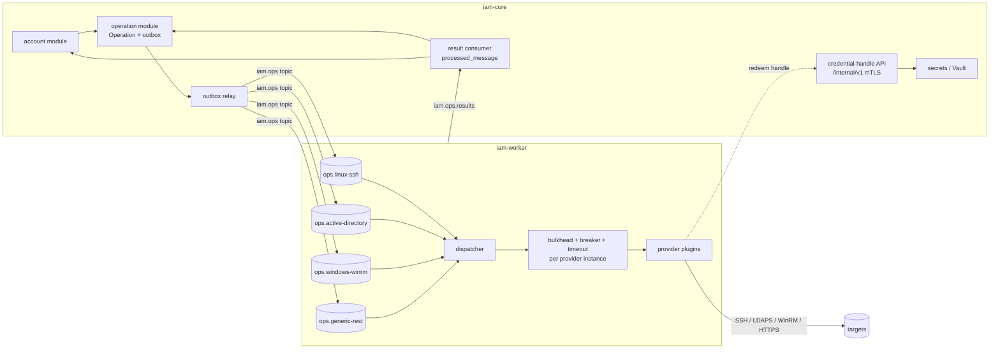

# Phase 3 Design — Core Providers and Account Management

| Field | Value |
|---|---|
| Phase | 3 — Core Providers |
| Date | 2026-09-22 |
| Authorization | Owner, 2026-09-22: "continue the remaining phases; I will send any errors" |
| Phase 2 status | Treated as approved. C2 runtime checks passed 27/27; the final CI run on PR #6 (dependency upgrade) is in progress |
| Gate handling (owner) | The owner asked for continuous progress. Each phase ends with a gate report and a checkpoint bundle, and work moves on to the next phase unless the owner objects. Gate reports stay reviewable at any time. |
| Environment inputs | Q-07/Q-08/Q-09 unanswered → documented defaults (§2). Every default is configuration, not code. |
| Related | ADR-0003 (SPI), ADR-0010 (worker pools), [WORKER-ISOLATION.md](../architecture/WORKER-ISOLATION.md), ADR-0018 (provider libraries, this phase) |

## 1. Scope

| # | Item | Result |
|---|---|---|
| 1 | **Worker runtime** (`worker/`, image `iam-worker`) | Consumes the per-provider queues `ops.<type>`. Runs providers inside per-instance bulkheads with circuit breakers and timeouts, and publishes results to `iam.ops.results`. |
| 2 | **Operation dispatch and results in Core** | Operations are created with an outbox command (transactional) and a result consumer (idempotent). Mutating `SUCCESS` requires verification (V3 CHECK). Deadline sweep → `TIMEOUT`. |
| 3 | **Credential handles** | Core issues single-use handles (TTL ≤ 60 s) bound to an operation. The worker redeems them just in time via `/internal/v1/credential-handles/{h}:redeem` over mTLS. Secrets never enter the queue. |
| 4 | **Account Management Core** (G8) | Accounts, managed accounts, entitlements and assignments, governance states, and findings: orphan, unmanaged, dormant, unexpected, privileged-without-owner. |
| 5 | **Discovery import** | `DISCOVER_ACCOUNTS` / `DISCOVER_GROUPS` pages are imported read-only. They never modify targets. Accounts are matched to identities by rule: username = identity username, or an e-mail or employee-id attribute. |
| 6 | **Capability snapshots** | `CapabilitySnapshot` per target is computed from the provider descriptor plus live health. Unsupported calls return `UNSUPPORTED_CAPABILITY` with an explanation (G5). |
| 7 | **Providers** | `linux-ssh`, `windows-winrm`, `active-directory`, `generic-rest` (SCIM 2.0). See §4. |
| 8 | **UI** | Accounts list and detail (scope-filtered), findings, provider instance "Test connection" and "Run discovery", and operation progress. |
| 9 | **Failure tests** | Provider X unreachable → its breaker opens and other providers' latency is unchanged (WORKER-ISOLATION §8, tests 1, 2, 4, 5). |

Out of scope (later phases): request/approval/policy (4), infrastructure providers such as VMware, OVM, HPE, network, and database (5), PAM sessions and gateways (6), and scheduled discovery/drift (8). Phase 3 discovery is triggered manually or via API.

## 2. Environment defaults (Q-07 / Q-08 / Q-09)

| Question | Default used | Where it is configured |
|---|---|---|
| Q-07 AD | One or more domains, each a separate provider instance. LDAPS on 636 with the CA certificate supplied per instance. Service account with delegated OU rights (no Domain Admin). Password reset and unlock need LDAPS. | Provider instance `endpoint` + `settings` (baseDn, userOu, groupOu, caCertRef) |
| Q-08 Linux | SSH key authentication. The service account uses `sudo` with a restricted command list (`useradd`, `usermod`, `chage`, `passwd`, `getent`, `gpasswd`), defaults to `sudo -n`, and has no interactive shell. Jump hosts are deferred to Phase 6 (gateway). | Instance settings (sudo=true, shell policy) + Vault credential |
| Q-09 Windows | WinRM over HTTPS (5986) with NTLM or Kerberos authentication. Local accounts only (domain accounts belong to the AD provider). A LAPS-managed local admin is detected and reported as "managed externally". | Instance settings (auth=ntlm, verifyTls=true) |

## 3. Runtime architecture

Rules:

- **Queue isolation (G4).** One queue per provider type, with dedicated consumers and prefetch. The worker can run as one container per pool group (`WORKER_POOLS=linux-ssh` or similar), so a slow provider cannot starve others.
- **Resilience per provider instance.** Circuit breaker (50 % over 20 calls or 5 consecutive connect failures, half-open after 60 s with one trial call), semaphore bulkhead (default 4 calls per instance), and a hard deadline per operation (2 min lifecycle, 30 min discovery). While a breaker is open, operations for that instance fail fast with `PROVIDER_UNAVAILABLE` (retryable, nothing applied) instead of occupying pool capacity. Transient failures are retried up to 3 times inside the deadline, re-using the once-redeemed credential.
- **Verification.** Every mutating call is followed by `getAccountState` or a provider-specific check. `VerificationMode` decides between immediate and eventual verification (AD replication). The result is `SUCCESS` only with verification evidence; otherwise it is `PARTIAL` or `VERIFICATION_FAILED`.
- **Idempotency.** Commands carry `idempotencyKey`. Providers implement create-if-absent, disable-if-enabled, and so on, and the worker keeps a 24 h processed-key cache. Core allows one in-flight mutating operation per account.

## 4. Provider capability matrix (initial)

| Capability | linux-ssh | windows-winrm | active-directory | generic-rest (SCIM 2.0) |
|---|---|---|---|---|
| Connection validation | ✔ | ✔ | ✔ | ✔ |
| Account discovery | ✔ `getent passwd` + `/etc/shadow` status via sudo | ✔ `Get-LocalUser` | ✔ paged LDAP search | ✔ `/Users` paging |
| Group discovery | ✔ `getent group` | ✔ `Get-LocalGroup(Member)` | ✔ | ✔ `/Groups` |
| Account state read | ✔ | ✔ | ✔ (`userAccountControl`, `lockoutTime`, `pwdLastSet`) | ✔ |
| Create | ✔ `useradd` | ✔ `New-LocalUser` | ✔ | ✔ POST |
| Enable / disable | ✔ `usermod -U/-L` + `chage -E` | ✔ | ✔ UAC bit | ✔ `active` |
| Unlock | ✔ `faillock --reset` / `pam_tally2` (detected) | ✔ | ✔ `lockoutTime=0` | UNSUPPORTED (SCIM has no lock) |
| Password reset / rotate | ✔ `chpasswd` via stdin | ✔ | ✔ `unicodePwd` over LDAPS | ✔ PATCH password (if the target supports it; otherwise UNSUPPORTED) |
| Delete | ✔ (policy-gated, off by default) | ✔ (off by default) | ✔ (off by default) | ✔ (off by default) |
| Group membership | ✔ `gpasswd` | ✔ | ✔ | ✔ |
| Privilege detection | sudoers groups (`wheel`, `sudo`, `admin`), UID 0 | Administrators group | Protected groups (Domain/Enterprise/Schema Admins, Account Operators, …), `adminCount=1` | configurable role attribute |

Anything a target cannot do is declared `UNSUPPORTED` or `AGENT_REQUIRED` with a reason. Nothing is simulated (G5).

## 5. Data model (migrations V9–V11)

- **V9 account:** `account`, `managed_account`, `entitlement`, and `entitlement_assignment` as in DATA-MODEL.md, plus `account_finding (id, account_id, type, severity, detected_at, resolved_at, details)` and `discovery_run (id, provider_instance_id, target_id, operation_id, started_at, finished_at, status, counts jsonb)`.
- **V10 provider runtime:** `capability_snapshot`, `credential_handle (handle_hash PK, operation_id, secret_ref, purpose, expires_at, redeemed_at, redeemed_by)`. Only a hash of the handle is stored.
- **V11 permissions and roles:**
  - New permissions: `account:read`, `account:write`, `account:discover`, `account:finding:resolve`, `operation:execute`.
  - These are added to PLATFORM_ADMINISTRATOR, IAM_ADMINISTRATOR, INFRASTRUCTURE_ADMINISTRATOR, and AUDITOR (read only).

## 6. Security

- **Worker identity.** Workers authenticate to the Core internal API with mTLS. In development, `deploy/compose/scripts/pki-dev.sh` creates a CA and certificates in `secrets/`; in production, Vault PKI (Phase 10). RabbitMQ credentials are separate per worker group, and workers get no platform DB access.
- **Credential handles.** Redemption requires the certificate subject of the worker whose pool owns the operation's provider type. It is single-use and audited as `credential.redeem`. The secret value exists only in worker memory for the duration of the call and is never logged (tests seed a canary secret and scan logs).
- **SSRF and target reachability.** Provider endpoints are validated against an administrator allow-list of CIDRs and host names (setting `iam.providers.allowed-targets`).
- **Command injection.** Linux and Windows providers never interpolate user input into shell or PowerShell strings. Arguments are validated (POSIX username regex, AD sAMAccountName rules) and passed as argument vectors or stdin. PowerShell uses `-EncodedCommand` with parameters bound from JSON.

## 7. Testing

| Level | What |
|---|---|
| Contract kit | Every provider passes `ProviderContractTest` (descriptor consistency, UNSUPPORTED paths, no success without verification). |
| linux-ssh | Testcontainers `openssh-server` (Ubuntu and Rocky images): the full lifecycle with real `useradd`/`usermod`/`chage`. |
| active-directory | Testcontainers Samba 4 AD DC with LDAPS: create, disable, unlock, password reset, group membership. |
| generic-rest | WireMock SCIM 2.0 server with recorded responses, plus negative cases. |
| windows-winrm | Recorded WS-Management fixtures (WireMock). A real Windows host cannot run in Linux CI, so a manual lab run against a Windows VM is part of the gate checklist. |
| Worker isolation | Toxiproxy black-holes the linux endpoint → breaker opens; AD throughput unchanged within tolerance. A poison message ends in the DLQ. Vault down → operations wait and then end in `TIMEOUT` with `SECRETS_UNAVAILABLE`. |
| Core | Result consumer idempotency, verification-required CHECK, discovery import is read-only, findings rules, scope-filtered account queries (IDOR). |

## 8. Implementation increments

Each increment ends with `ci/local-build.sh` and `ci/local-checks.sh` on the owner's server and a local commit. Checkpoint bundles are sent at 3.2, 3.5, and the gate.

| Increment | Content |
|---|---|
| 3.1 | ADR-0018. Migrations V9–V11. Account module (domain, application, JDBC, API). Findings rules. |
| 3.2 | Operation dispatch service, result consumer, credential handles + internal API, deadline sweep. |
| 3.3 | `worker/` runtime: pools, resilience, handle redemption, result publisher, image, compose service. |
| 3.4 | `providers/linux-ssh` + Testcontainers tests. |
| 3.5 | `providers/active-directory` (UnboundID LDAP SDK) + Samba AD tests. |
| 3.6 | `providers/generic-rest` (SCIM) + WireMock tests. |
| 3.7 | `providers/windows-winrm` + fixtures. |
| 3.8 | UI (Accounts, Findings, Test connection, Discovery). Failure tests. `smoke-phase3.sh`. Gate report. |

## 9. Acceptance criteria (Phase 0 §11)

- Each provider declares capabilities, and unsupported calls return `UNSUPPORTED_CAPABILITY` with an explanation.
- Account discovery imports accounts without modifying targets.
- Create, enable, disable, unlock, reset, and rotate are idempotent and verified, with `SUCCESS` only after verification.
- Linux, Windows Local, and Application providers work with AD disabled.
- When provider X is unreachable, its circuit opens within the configured threshold, and operations on other providers are unaffected (latency unchanged within tolerance).

## 10. Risks

| Risk | Mitigation |
|---|---|
| The development sandbox cannot resolve Maven dependencies, so code is compiled first on the owner's server. | Small increments. `ci/local-build.sh` after each one. Errors are fixed before the checkpoint push. |
| Real estate unknown (Q-07–Q-09) | Defaults are configuration. A connectivity spike per provider runs against one real host before the Phase 3 gate. |
| Windows cannot be tested in Linux CI | Recorded fixtures plus a documented manual lab run in the gate checklist. |
