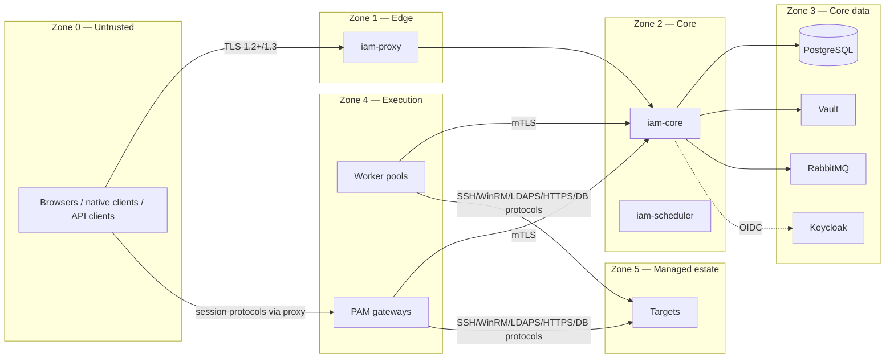

# Security Architecture

| Field | Value |
|---|---|
| Phase | 1 |
| Scope | Platform-wide controls; per-extension security designs (gateways, agent) are produced before their implementation phases |
| Related | [Threat Model — Core](THREAT-MODEL-CORE.md) · ADR-0004, 0005, 0008, 0009, 0012, 0013 |

## 1. Security objectives

1. No access is granted, no secret is released, and no privileged session is opened unless identity, authorization, policy, SoD, and (where required) approval are verified — fail closed (§4).
2. Secret values exist only in Vault and, transiently, in the memory of the component that needs them.
3. Every privileged action is attributable, audited in the same transaction, tamper-evident, and traceable through the evidence chain.
4. Compromise or failure of an extension does not compromise or disable the Core.
5. The platform itself meets the controls it enforces (MFA for admins, least privilege, SoD for platform administration).

## 2. Trust zones and boundaries

Boundary rules: Zone 0 reaches only Zone 1. Zone 4 reaches Zone 2 only through `/internal/v1` with mTLS, and Zone 5 only from Zone 4. The Core (Zone 2) never connects to targets directly. Zone 3 is reachable only from Zone 2 (and RabbitMQ from Zone 4 with per-group credentials).

## 3. Identity and authentication

| Actor | Mechanism | Assurance |
|---|---|---|
| Human platform user | Keycloak OIDC Authorization Code + PKCE via Core BFF; MFA (TOTP, WebAuthn, passkeys) | MFA mandatory for all roles with any write or privileged permission; `acr` step-up for sensitive actions |
| Automation client | OAuth2 client credentials (Keycloak), scoped, short-lived tokens | Client registered to a SERVICE identity with an owner |
| Worker / gateway / scheduler | mTLS client certificate from Vault PKI (per instance, ≤ 72 h validity, auto-renewed) + component registration in Core | Certificate subject bound to registered component; revocation list checked |
| Agent | mTLS with enrolment approval (§17) | Per-host certificate; revocable |

Session security: BFF cookie (`__Host-iam_session` with TLS in production, `IAM_SESSION` in HTTP development), HttpOnly, Secure (production), SameSite=Lax for the session cookie (the OIDC redirect back from Keycloak is a top-level navigation) and SameSite=Strict for the CSRF cookie; idle timeout 15 min, absolute 8 h (configurable); CSRF synchronizer token for state-changing requests; session fixation protection; concurrent session limit per user; logout revokes the Keycloak session and the platform session.

Step-up matrix (initial): approve/reject requests, reveal/checkout secrets, start HIGH/CRITICAL-risk sessions, emergency access, role/permission/policy/SoD changes, security settings, audit export → require `acr` ≥ `mfa` with authentication age ≤ 5 min.

## 4. Authorization

Deny-by-default RBAC with scopes (DOMAIN-MODEL §4) + central policy for sensitive actions (ADR-0013). Object-level authorization in the application layer for every read and write; list/search/report queries are scope-filtered in SQL. Out-of-scope objects return `404`. Platform-administration SoD: an administrator cannot approve their own role changes; `GLOBAL` scope assignment requires dual control; audit roles are read-only and cannot hold operator roles (SoD rule operator ≠ auditor).

## 5. Secrets management

- Vault KV v2 (static), Database secrets engine (dynamic, where supported), PKI (internal mTLS), Transit (signing of audit checkpoints; envelope encryption for sensitive non-secret fields where needed).
- Core authenticates to Vault with AppRole; `secret_id` delivered via Compose/K8s secret, response-wrapped; Vault token TTL ≤ 1 h, renewable, least-privilege Vault policies per function (`iam-core-secrets`, `iam-core-pki`, `iam-core-transit`).
- Credential handles: 128-bit random, single use, TTL ≤ 60 s, bound to (component identity, operation or session ID). Redemption audited.
- Reveal to humans: policy-controlled, justified, optionally approval + dual control, time-boxed display, audited with reason; post-reveal rotation policy configurable.
- `Secret` type in `shared-kernel`: no `toString` exposure, not serializable by Jackson, explicit `reveal()` call sites are reviewable with a Semgrep rule.

## 6. Cryptography

TLS 1.3 preferred, 1.2 minimum with modern suites, everywhere including internal networks. Password hashing only in Keycloak (platform does not store user passwords). Hash chain SHA-256; signatures via Vault Transit (Ed25519 or ECDSA P-256). Encryption at rest: PostgreSQL volume encryption at the storage layer (host/LUKS or SAN), Vault barrier encryption, object-store server-side encryption. Key rotation schedules documented in Phase 10.

## 7. Audit integrity

Per ADR-0008: in-transaction audit writes; INSERT/SELECT-only DB grants; UPDATE/DELETE triggers; hash chain; signed checkpoints; WORM archive; verifier job; audit of audit access and export. Clock: all containers NTP-synchronized via host; timestamps UTC.

## 8. Data protection (§71)

Structured logging through a single logging configuration with (1) a redaction layer for known sensitive keys and patterns (passwords, tokens, private keys, connection strings), (2) no request/response body logging for sensitive endpoints, (3) exception handler returning the §73 model only. Tests assert that seeded secret values never appear in logs, error responses, metrics, or traces.

## 9. Application security controls (§58)

Input validation (Bean Validation + size limits), output encoding (React default escaping; no `dangerouslySetInnerHTML`), CSP `default-src 'self'` with nonces, HSTS, `X-Content-Type-Options`, `frame-ancestors 'none'` (except gateway viewer frames where required, scoped), `Referrer-Policy: no-referrer`. Rate limiting and brute-force protection at Keycloak (login) and Core (API, per identity/IP). SSRF: provider endpoints validated against an allow-list of CIDRs/hostnames configured by administrators; no user-supplied URL fetches from the Core. XML parsers hardened (XXE off). Deserialization: JSON only, no polymorphic default typing.

## 10. Container and supply-chain security

ADR-0009 hardening baseline; images non-root, read-only, no capabilities; base images pinned by version and digest (digest pinning automated in Phase 9); SBOM per image; Trivy image, filesystem, and IaC scanning; Gitleaks on every push and full history; Semgrep (Java, TypeScript, Dockerfile, YAML rules + project rules); OWASP Dependency-Check; dependency update bot with CI gate; signed images (cosign) once a registry is decided.

## 11. Logging, monitoring, and response

Security events (authentication failures, step-up failures, denied authorizations, policy denials, SoD conflicts, emergency access, secret reveal, audit verification failure, certificate anomalies, agent/gateway registration) are emitted as structured events to the audit subsystem and exported to SIEM (Wazuh JSON / Syslog / CEF). Alert rules delivered in Phase 8/9.

## 12. Security testing (§68)

See [testing strategy in the Phase 0 report §15] and Phase 9. From Phase 2, every phase gate includes authorization-matrix tests, IDOR tests, audit-integrity tests, secret-leak tests, and failure tests; Phase 9 adds DAST (ZAP), API fuzzing, and external penetration testing.
